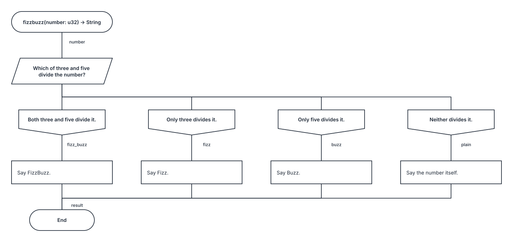
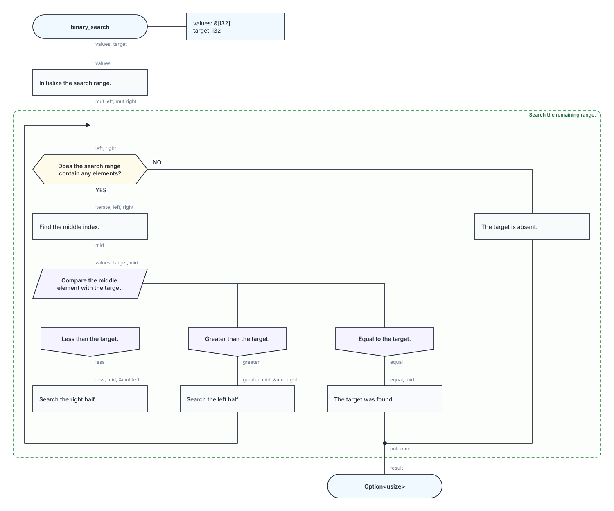
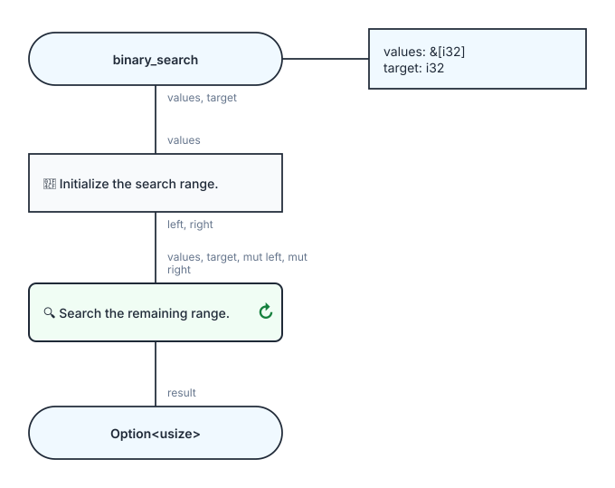

# kaalang

[![crates.io][crates-io-badge]][crates-io] [![docs.rs][docs-rs-badge]][docs-rs]
[![CI][ci-badge]][ci]

> We be of one blood, thou and I - man and snake together.
>
> Kaa - from Rudyard Kipling's [“The Spring Running”][spring-running], _The
> Second Jungle Book_

kaalang is a visual flow dialect of Rust for understanding what a program does
and how its parts fit together. Inspired by DRAKON, it makes the structure of an
algorithm explicit in code.

You write an algorithm as described steps, decisions, and cycles, with explicit
inputs and outputs. Rust expressions implement the computations inside those
blocks. The same validated flow becomes ordinary Rust code and a readable
diagram.

Whether written by a person or AI, the code keeps its decisions and dependencies
explicit, while descriptions explain each step's purpose. That makes the flow
easier to read, explain, change, and review.

_Work in progress._

## A first flow: FizzBuzz

A flow is a Rust function marked with `#[kaalang]`. Here, it chooses what to say
based on whether a number is divisible by three, five, both, or neither.

```rust
use kaalang::kaalang;

#[kaalang]
fn fizzbuzz(number: u32) -> String {
    #[choice("Which of three and five divide the number?")]
    #[case("Both three and five divide it.")]
    #[case("Only three divides it.")]
    #[case("Only five divides it.")]
    #[case("Neither divides it.")]
    let (fizz_buzz, fizz, buzz, plain) = |number| match (number % 3, number % 5) {
        (0, 0) => (),
        (0, _) => (),
        (_, 0) => (),
        _ => number,
    };

    #[action("🎉 Say FizzBuzz.")]
    let end = |fizz_buzz| String::from("FizzBuzz");

    #[action("🫧 Say Fizz.")]
    let end = |fizz| String::from("Fizz");

    #[action("🐝 Say Buzz.")]
    let end = |buzz| String::from("Buzz");

    #[action("🔢 Say the number itself.")]
    let end = |plain| plain.to_string();

    |end| return end;
}
```

[](crates/kaalang/tests/gallery/fizzbuzz/fizzbuzz.svg)

[Source](crates/kaalang/tests/gallery/fizzbuzz/mod.rs)

## Reading the flow

A **wire** is a named value passed between blocks. The function parameter
provides the first wire, `number`. Each block lists the wires it captures
between `|...|` and names the wires it produces after `let`.

| In the example                             | What happens                                                                                                                     |
| ------------------------------------------ | -------------------------------------------------------------------------------------------------------------------------------- |
| `let (fizz_buzz, fizz, buzz, plain) = ...` | The `choice` evaluates its `match` and provides only the selected output. Cases, outputs, and match arms correspond by position. |
| `let end = \|fizz\| ...`                   | Capturing `fizz` places this action on the Fizz branch, even though its body does not use that unit value.                       |
| Four declarations of `end`                 | The branches are mutually exclusive. Their results merge into one wire for the shared continuation.                              |
| `\|end\| return end;`                      | The flow returns whichever branch supplied `end`.                                                                                |

For `number = 9`, only `fizz` is selected, so only the “Say Fizz” action runs.
The diagram's connections show execution paths; input and output names appear as
labels along those paths.

The `#[kaalang]` macro translates the capture notation into ordinary Rust
bindings and control flow. Blocks execute in source order along the selected
path. Rust checks types, ownership, borrowing, and lifetimes.

The diagram is generated from the same validated model used to produce the Rust
code. kaalang checks that the flow admits a diagram under its visual rules
before compiling it.

## Anatomy of a block

Here is the last action from FizzBuzz, with its Rust body wrapped in braces:

```rust
#[action("🔢 Say the number itself.")]  // kind + description
let end = |plain| {                     // output = |inputs|
    plain.to_string()                   // Rust body
};
```

| Part                 | In this action          | Variations                                                                            |
| -------------------- | ----------------------- | ------------------------------------------------------------------------------------- |
| Kind and description | `#[action("...")]`      | Both are required for an action. The description labels its diagram node.             |
| Outputs              | `let end =`             | Omit for an effect returning `()`. Use `let (left, right) =` to expose two outputs.   |
| Inputs               | `\|plain\|`             | Use `\|\|` when there are no inputs. Every wire used by the body must be listed here. |
| Body                 | `{ plain.to_string() }` | A Rust expression. An action may omit the braces, as in the full example.             |

Actions can also create a value without inputs, consume inputs without producing
outputs, or perform an effect with neither:

```rust
// No inputs.
#[action("Start with fifteen.")]
let number = || { 15 };

// No outputs.
#[action("Print the result.")]
|&end| { println!("{end}") };

// Neither: the empty capture list can be omitted too.
#[action("Announce the flow.")]
{
    println!("start");
};
```

Captures express how an action accesses a wire:

| Input       | Access                                     |
| ----------- | ------------------------------------------ |
| `name`      | Move or copy the value.                    |
| `mut name`  | Move or copy into a mutable local binding. |
| `&name`     | Borrow the value.                          |
| `&mut name` | Mutably borrow a wire declared mutable.    |

See the
[capture rules](docs/rfcs/0001-language.md#6-wires-producers-and-captures) for
the details.

## Block kinds

FizzBuzz uses `choice` and `action`. The other kinds let a flow ask a yes/no
question, call an existing function, or repeat a sequence:

| Kind       | Role in a flow                                                                      |
| ---------- | ----------------------------------------------------------------------------------- |
| `action`   | Perform a computation or effect with a Rust expression.                             |
| `call`     | Call one named Rust function. Its name supplies the description if omitted.         |
| `question` | Select one of two branch outputs using a boolean expression.                        |
| `choice`   | Select one output per visit from the cases of a Rust `match`.                       |
| `cycle`    | Repeat a nested kaalang sequence, preserving its captured state between iterations. |
| `break`    | Complete the directly containing cycle and hand back its result.                    |
| `return`   | Complete the root flow and hand back its result.                                    |

Actions, calls, and cycles can have no outputs. Questions and choices always
declare their branch outputs. A cycle contains kaalang blocks; its result
becomes available when it reaches `break`. In the diagram, `break` and `return`
appear as routes to the cycle boundary or flow end.

The [language RFC](docs/rfcs/0001-language.md#4-block-kinds) defines each kind;
the [visual language RFC](docs/rfcs/0002-visual-language.md#4-node-kinds)
defines its representation.

## Putting it together: binary search

Searching a sorted slice adds state and repetition. Each iteration checks
whether any candidates remain, compares the middle value with the target, and
either narrows the range or finishes with `Some(index)` or `None`.

```rust
use std::cmp::Ordering;

use kaalang::kaalang;

#[kaalang]
fn binary_search(values: &[i32], target: i32) -> Option<usize> {
    #[action("📏 Initialize the search range.")]
    let (left, right) = |values| (0, values.len());

    #[cycle("🔍 Search the remaining range.")]
    let result = |values, target, mut left, mut right| {
        #[question("Does the search range contain any elements?")]
        #[yes("YES")]
        #[no("NO")]
        let (iterate, leave) = |left, right| left < right;

        #[action("🚫 The target is absent.")]
        let outcome = |leave| None;

        #[action("📍 Find the middle index.")]
        let mid = |iterate, left, right| left + (right - left) / 2;

        #[choice("Compare the middle element with the target.")]
        #[case("Less than the target.")]
        #[case("Greater than the target.")]
        #[case("Equal to the target.")]
        let (less, greater, equal) = |values, target, mid| match values[mid].cmp(&target) {
            Ordering::Less => (),
            Ordering::Greater => (),
            Ordering::Equal => (),
        };

        #[action("➡️ Search the right half.")]
        |less, mid, &mut left| *left = mid + 1;

        #[action("⬅️ Search the left half.")]
        |greater, mid, &mut right| *right = mid;

        #[action("🎯 The target was found.")]
        let outcome = |equal, mid| Some(mid);

        |outcome| break outcome;
    };

    |result| return result;
}
```

[](crates/kaalang/tests/gallery/binary_search/binary_search.svg)

[Source](crates/kaalang/tests/gallery/binary_search/mod.rs)

The cycle captures `left` and `right` as mutable local state. The `less` and
`greater` branches update that state and reach the next iteration. The `equal`
and `leave` branches instead produce `outcome`, merging before the shared
`break`. That value becomes the cycle's `result`, which the flow returns.

<details>
<summary>See the same flow with its cycle collapsed</summary>

[](crates/kaalang/tests/gallery/binary_search/binary_search_collapsed.svg)

The cycle's description and interface remain visible while its body is hidden.

</details>

Both examples are [executable gallery tests](crates/kaalang/tests/gallery), with
SVGs generated from their source. The gallery also includes
[swap](crates/kaalang/tests/gallery/swap/mod.rs), a flow that returns its inputs
without a computational block, and
[bubble sort](crates/kaalang/tests/gallery/bubble_sort/mod.rs), with nested
cycles.

## Try it

Install the released CLI from crates.io:

```sh
cargo install kaalang-cli
```

Or install the version from the current repository checkout:

```sh
cargo install --path crates/kaalang-cli
```

From a repository checkout, draw the FizzBuzz example:

```sh
cargo kaalang diagram crates/kaalang/tests/gallery/fizzbuzz/mod.rs --flow fizzbuzz -o fizzbuzz.svg
```

Open `fizzbuzz.svg` in a browser. Replace the source path and flow name to
render another example; add `--collapse-loops` for the compact cycle view shown
above. The output is a standalone SVG with no external rendering tools required.

## Read more

The RFCs are the source of truth for syntax, semantics, and diagrams.

- [Language](docs/rfcs/0001-language.md)
- [Visual language](docs/rfcs/0002-visual-language.md)
- [SVG renderer](docs/rfcs/0003-svg-renderer.md)
- [Rust lowering](docs/rfcs/0004-rust-lowering.md)
- [Contributing](CONTRIBUTING.md)

[spring-running]: https://www.gutenberg.org/cache/epub/37364/pg37364-images.html
[ci]: https://github.com/kalaninja/kaalang/actions/workflows/ci.yml
[ci-badge]:
  https://github.com/kalaninja/kaalang/actions/workflows/ci.yml/badge.svg
[crates-io]: https://crates.io/crates/kaalang
[crates-io-badge]: https://img.shields.io/crates/v/kaalang.svg
[docs-rs]: https://docs.rs/kaalang
[docs-rs-badge]: https://docs.rs/kaalang/badge.svg
