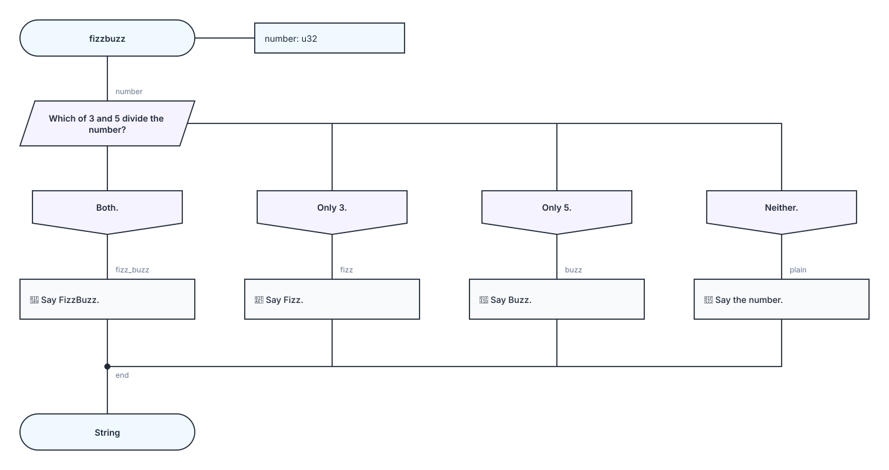
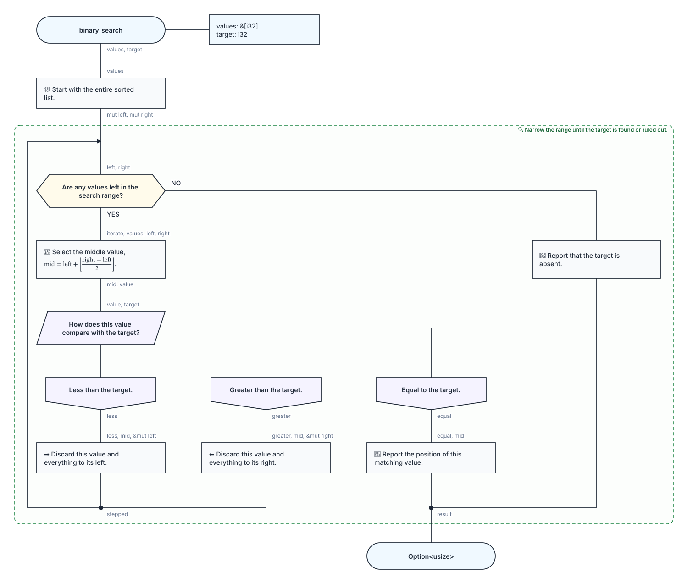
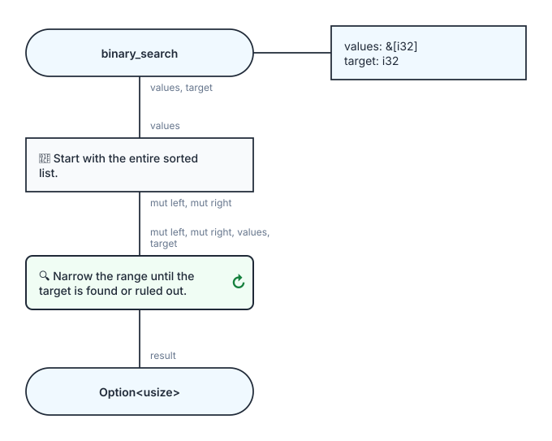
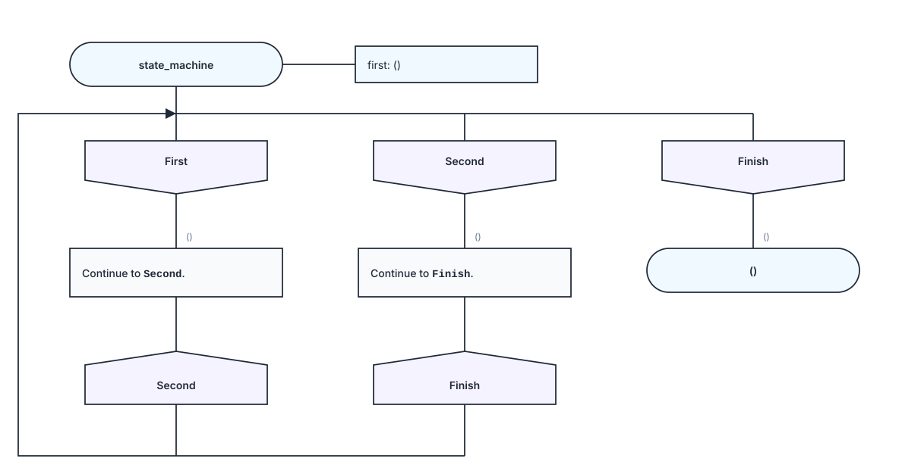
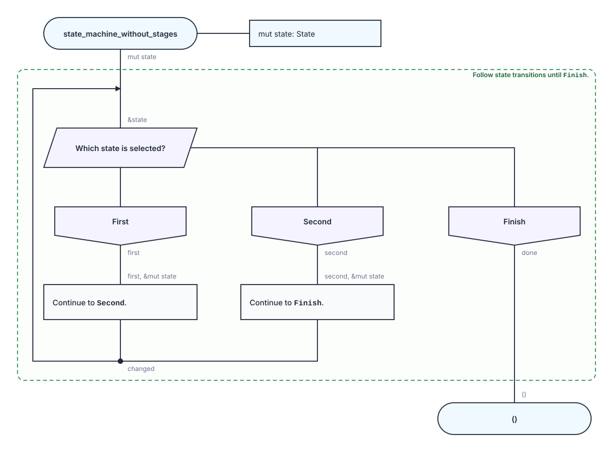
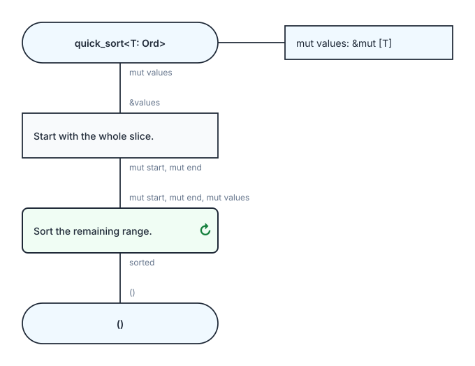

# kaalang

[![crates.io][crates-io-badge]][crates-io] [![docs.rs][docs-rs-badge]][docs-rs]
[![CI][ci-badge]][ci]

> We be of one blood, thou and I - man and snake together.
>
> Kaa - from Rudyard Kipling's [“The Spring Running”][spring-running], _The
> Second Jungle Book_

kaalang is a visual flow dialect of Rust for understanding what a program does
and how its parts fit together. Inspired by DRAKON, it makes the structure of an
algorithm explicit in code.

You write an algorithm as described steps, decisions, and cycles, with explicit
inputs and outputs. Rust expressions implement the computations inside those
blocks. The same validated flow becomes ordinary Rust code and a readable
diagram.

Whether written by a person or AI, the code keeps its decisions and dependencies
explicit, while descriptions explain each step's purpose. That makes the flow
easier to read, explain, change, and review.

_Work in progress._

## A first flow: FizzBuzz

A flow is a Rust function marked with `#[kaalang]`. Here, it chooses what to say
based on whether a number is divisible by three, five, both, or neither.

```rust
use kaalang::kaalang;

#[kaalang]
fn fizzbuzz(number: u32) -> String {
    #[choice("Which of 3 and 5 divide the number?")]
    #[case("Both 3 and 5.")]
    #[case("Only 3.")]
    #[case("Only 5.")]
    #[case("Neither 3 nor 5.")]
    let (fizz_buzz, fizz, buzz, plain) = |number| match (number % 3, number % 5) {
        (0, 0) => (),
        (0, _) => (),
        (_, 0) => (),
        _ => number,
    };

    #[action("🎉 Use `FizzBuzz` for this number.")]
    let end = |fizz_buzz| String::from("FizzBuzz");

    #[action("🫧 Use `Fizz` for this number.")]
    let end = |fizz| String::from("Fizz");

    #[action("🐝 Use `Buzz` for this number.")]
    let end = |buzz| String::from("Buzz");

    #[action("🔢 Use the number itself, written as text.")]
    let end = |plain| plain.to_string();

    |end| return end;
}
```

[](crates/kaalang/tests/gallery/fizzbuzz/fizzbuzz.svg)

[Source](crates/kaalang/tests/gallery/fizzbuzz/mod.rs)

## Reading the flow

A **wire** is a named value passed between blocks. The function parameter
provides the first wire, `number`. Each block lists the wires it captures
between `|...|` and names the wires it produces after `let`.

| In the example                             | What happens                                                                                                                     |
| ------------------------------------------ | -------------------------------------------------------------------------------------------------------------------------------- |
| `let (fizz_buzz, fizz, buzz, plain) = ...` | The `choice` evaluates its `match` and provides only the selected output. Cases, outputs, and match arms correspond by position. |
| `let end = \|fizz\| ...`                   | Capturing `fizz` places this action on the Fizz branch, even though its body does not use that unit value.                       |
| Four declarations of `end`                 | The branches are mutually exclusive. Their results merge into one wire for the shared continuation.                              |
| `\|end\| return end;`                      | The flow returns whichever branch supplied `end`.                                                                                |

For `number = 9`, only `fizz` is selected, so only the “Use `Fizz` for this
number” action runs. The diagram's connections show execution paths; input and
output names appear as labels along those paths.

The `#[kaalang]` macro translates the capture notation into ordinary Rust
bindings and control flow. Blocks execute in source order along the selected
path. Rust checks types, ownership, borrowing, and lifetimes.

The diagram is generated from the same validated model used to produce the Rust
code. kaalang checks that the flow admits a diagram under its visual rules
before compiling it.

## Anatomy of a block

Here is the last action from FizzBuzz, with its Rust body wrapped in braces:

```rust
#[action("🔢 Say the number itself.")]  // kind + description
let end = |plain| {                     // output = |inputs|
    plain.to_string()                   // Rust body
};
```

| Part                 | In this action          | Variations                                                                          |
| -------------------- | ----------------------- | ----------------------------------------------------------------------------------- |
| Kind and description | `#[action("...")]`      | Both are required for an action. The description labels its diagram node.           |
| Outputs              | `let end =`             | Omit for an effect returning `()`. Use `let (left, right) =` to expose two outputs. |
| Inputs               | `\|plain\|`             | Omit it when there are no inputs. Every wire used by the body must be listed here.  |
| Body                 | `{ plain.to_string() }` | A Rust expression. An action may omit the braces, as in the full example.           |

Actions can also create a value without inputs, consume inputs without producing
outputs, or perform an effect with neither:

```rust
// No inputs: the capture list can be omitted.
#[action("Start with fifteen.")]
let number = 15;

// No outputs.
#[action("Print the result.")]
|&end| { println!("{end}") };

// Neither: the empty capture list can be omitted too.
#[action("Announce the flow.")]
{
    println!("start");
};
```

Captures express how an action accesses a wire:

| Input       | Access                                     |
| ----------- | ------------------------------------------ |
| `name`      | Move or copy the value.                    |
| `mut name`  | Move or copy into a mutable local binding. |
| `&name`     | Borrow the value.                          |
| `&mut name` | Mutably borrow a wire declared mutable.    |

## Block kinds

FizzBuzz uses `choice` and `action`. The other kinds let a flow ask a yes/no
question, call an existing function, repeat a sequence, or organize work into
named stages:

| Kind       | Role in a flow                                                               |
| ---------- | ---------------------------------------------------------------------------- |
| `action`   | Perform a computation or effect with a Rust expression.                      |
| `call`     | Call one named Rust function. Its name supplies the description if omitted.  |
| `question` | Select one of two branch outputs using a boolean expression.                 |
| `choice`   | Select one output per visit from the cases of a Rust `match`.                |
| `cycle`    | Repeat a nested kaalang sequence whose blocks capture the surrounding wires. |
| `stage`    | Group blocks into a named step selected by an incoming signal.               |
| `continue` | Start the next iteration of the directly containing cycle.                   |
| `return`   | Complete the root flow and hand back its result.                             |

Actions, calls, and cycles can have no outputs. Questions and choices always
declare their branch outputs. A cycle contains kaalang blocks. A route through
it can repeat at its one `continue`, complete with one declared output, or
diverge in a nested cycle. A completed output becomes available after the cycle.
In the diagram, `continue` routes meet at the cycle's back edge, completing
routes leave through the cycle boundary, and `return` reaches the flow end.

### Putting it together: binary search

Searching a sorted slice adds state and repetition. Each iteration checks
whether any candidates remain, compares the middle value with the target, and
either narrows the range or finishes with `Some(index)` or `None`.

```rust
use std::cmp::Ordering;

use kaalang::kaalang;

#[kaalang]
fn binary_search(values: &[i32], target: i32) -> Option<usize> {
    #[action("📏 Start with the entire sorted list.")]
    let (mut left, mut right) = |values| (0, values.len());

    #[cycle("🔍 Narrow the range until the target is found or ruled out.")]
    let result = {
        #[question("Are any values left in the search range?")]
        #[yes("YES")]
        #[no("NO")]
        let (iterate, leave) = |left, right| left < right;

        #[action("🚫 Report that the target is absent.")]
        let result = |leave| None;

        #[action("📍 Select the middle value of this range.")]
        let (mid, value) = |iterate, values, left, right| {
            let mid = left + (right - left) / 2;
            (mid, values[mid])
        };

        #[choice("How does this value compare with the target?")]
        #[case("Less than the target.")]
        #[case("Greater than the target.")]
        #[case("Equal to the target.")]
        let (less, greater, equal) = |value, target| match value.cmp(&target) {
            Ordering::Less => (),
            Ordering::Greater => (),
            Ordering::Equal => (),
        };

        #[action("➡️ Discard this value and everything to its left.")]
        let stepped = |less, mid, &mut left| *left = mid + 1;

        #[action("⬅️ Discard this value and everything to its right.")]
        let stepped = |greater, mid, &mut right| *right = mid;

        #[action("🎯 Report the position of this matching value.")]
        let result = |equal, mid| Some(mid);

        |stepped| continue;
    };

    |result| return result;
}
```

[](crates/kaalang/tests/gallery/binary_search/binary_search.svg)

[Source](crates/kaalang/tests/gallery/binary_search/mod.rs)

The cycle's blocks capture the surrounding `left` and `right`, declared `mut` so
the `less` and `greater` branches can update them. Both then produce `stepped`,
merging before the shared `continue` that starts the next iteration. The `equal`
and `leave` branches instead produce `result`, the cycle's declared output. They
merge at the end of the body, and the cycle hands `result` to the flow, which
returns it.

<details>
<summary>See the same flow with its cycle collapsed</summary>

[](crates/kaalang/tests/gallery/binary_search/binary_search_collapsed.svg)

The cycle's description and interface remain visible while its body is hidden.

</details>

Both examples are [executable gallery tests](crates/kaalang/tests/gallery), with
SVGs generated from their source. The gallery also includes
[swap](crates/kaalang/tests/gallery/swap/mod.rs), a flow that returns its inputs
without a computational block,
[bubble sort](crates/kaalang/tests/gallery/sorting/bubble_sort.rs), with nested
cycles, [quicksort](crates/kaalang/tests/gallery/sorting/quick_sort.rs), with
stages for in-place partitioning and recursion, and
[KMP search](crates/kaalang/tests/gallery/kmp_search/mod.rs), with stages for
comparison, advancement, and prefix fallback.

## Stages

A **stage** groups kaalang blocks into a named step. The flow enters one stage
at a time through its incoming signal. When a stage completes, its selected
output names the next stage and carries that stage's input value; a terminal
stage returns from the flow. A stage may also diverge in a cycle. When present,
preparation runs once, and its data can be shared across stage visits.

Stage declarations follow any preparation blocks. Without preparation, a
function input enters the first declared stage; preparation can enter any
declared stage. Stage descriptions must be unique. If there is no preparation
and the only stage has no outgoing transitions, write an ordinary flow.

Stages are syntactic and graphical sugar for a state machine written with a
cycle, a choice, and explicit state. The compiler generates the state and
dispatch loop. The diagram gives each stage its own area and labels transitions
with their destinations.

This empty state machine only follows `First → Second → Finish`. With stages:

[](crates/kaalang/tests/stage/behavior/state_machine.svg)

[Source](crates/kaalang/tests/stage/behavior/state_machine.rs)

Each stage passes control to the next through a named transition. The final
stage returns from the flow.

Without stages, the diagram shows the cycle and the choice that selects the
current state:

[](crates/kaalang/tests/stage/behavior/state_machine_without_stages.svg)

[Source](crates/kaalang/tests/stage/behavior/state_machine_without_stages.rs)

After each state update, control returns to the choice. Selecting `Finish`
leaves the cycle and reaches the return. Both versions follow the same path.

### Stages in practice: quicksort

Quicksort sorts a slice in place. Its stages check whether work remains,
partition the range around a pivot, sort the smaller group recursively, and
finish:

```rust
use core::cmp::Ordering;

use kaalang::kaalang;

#[kaalang]
pub(crate) fn quick_sort<T: Ord>(values: &mut [T]) {
    #[stage("Check the range.")]
    let (partition, finish) = |values| {
        #[question("Are there at least two values?")]
        #[yes("YES")]
        #[no("NO")]
        let (split, finish) = |&values| values.len() > 1;

        #[action("Take the unsorted range.")]
        let partition = |split, values| values;
    };

    #[stage("Partition the range.")]
    let recur = |partition| {
        #[action("Choose the middle value as the pivot; set it aside at the end.")]
        let (mut range, mut lower, mut cursor, mut upper, pivot) = |partition| {
            let pivot = partition.len() - 1;
            partition.swap(partition.len() / 2, pivot);
            (partition, 0, 0, pivot, pivot)
        };

        #[cycle("Group the other values around the pivot.")]
        let classified = {
            #[question("Are any values unclassified?")]
            #[yes("YES")]
            #[no("NO")]
            let (select, classified) = |cursor, upper| cursor < upper;

            #[action("Select the first unclassified value.")]
            let value = |select, &range, cursor| &range[cursor];

            #[choice("How does this value compare with the pivot?")]
            #[case("Less than the pivot.")]
            #[case("Equal to the pivot.")]
            #[case("Greater than the pivot.")]
            let (less, equal, greater) = |value, &range, pivot| match value.cmp(&range[pivot]) {
                Ordering::Less => (),
                Ordering::Equal => (),
                Ordering::Greater => (),
            };

            #[action("Put this value in the left group.")]
            let stepped = |less, &mut range, &mut lower, &mut cursor| {
                range.swap(*cursor, *lower);
                *lower += 1;
                *cursor += 1;
            };

            #[action("Keep this value in the middle group.")]
            let stepped = |equal, &mut cursor| *cursor += 1;

            #[action("Swap this value into the right group; check its replacement next.")]
            let stepped = |greater, &mut range, cursor, &mut upper| {
                *upper -= 1;
                range.swap(cursor, *upper);
            };

            |stepped| continue;
        };

        #[action("Place the pivot with its equals; separate the left and right groups.")]
        let recur = |classified, range, lower, upper, pivot| {
            range.swap(upper, pivot);
            let (left, rest) = range.split_at_mut(lower);
            let (_, right) = rest.split_at_mut(upper + 1 - lower);
            if left.len() <= right.len() {
                (left, right)
            } else {
                (right, left)
            }
        };
    };

    #[stage("Sort the smaller group.")]
    let values = |recur| {
        #[action("Take the smaller and larger outer groups.")]
        let (smaller, larger) = |recur| recur;

        #[call("Sort the smaller group recursively.")]
        let sorted_part = |smaller| quick_sort(smaller);

        #[action("Continue sorting the larger group.")]
        let values = |sorted_part, larger| larger;
    };

    #[stage("Finish sorting.")]
    |finish| {
        return;
    };
}
```

The partitioning cycle groups values below, equal to, and above the pivot. Only
the smaller outer group is sorted recursively. The `values` signal sends the
larger group back to the first stage, keeping the recursive call stack
logarithmic.

With the partitioning cycle collapsed, the four stages are easier to see:

[](crates/kaalang/tests/gallery/sorting/quick_sort_collapsed.svg)

[Source](crates/kaalang/tests/gallery/sorting/quick_sort.rs) ·
[Expanded diagram](crates/kaalang/tests/gallery/sorting/quick_sort.svg)

## Try it

Install the released CLI from crates.io:

```sh
cargo install kaalang-cli
```

Or install the version from the current repository checkout:

```sh
cargo install --path crates/kaalang-cli
```

From a repository checkout, draw the FizzBuzz example:

```sh
cargo kaalang diagram crates/kaalang/tests/gallery/fizzbuzz/mod.rs --flow fizzbuzz -o fizzbuzz.svg
```

Open `fizzbuzz.svg` in a browser. Replace the source path and flow name to
render another example; add `--collapse-loops` for the compact cycle view shown
above. The output is a standalone SVG with no external rendering tools required.

## Read more

- [RFCs](docs/rfcs/), the source of truth for syntax, semantics, and diagrams.
- [Contributing](CONTRIBUTING.md)

[spring-running]: https://www.gutenberg.org/cache/epub/37364/pg37364-images.html
[ci]: https://github.com/kalaninja/kaalang/actions/workflows/ci.yml
[ci-badge]:
  https://github.com/kalaninja/kaalang/actions/workflows/ci.yml/badge.svg
[crates-io]: https://crates.io/crates/kaalang
[crates-io-badge]: https://img.shields.io/crates/v/kaalang.svg
[docs-rs]: https://docs.rs/kaalang
[docs-rs-badge]: https://docs.rs/kaalang/badge.svg
