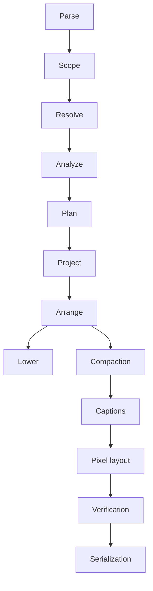

# Compiler and SVG Pipeline

This is an implementation map, not a language specification.

## Compiler stages

| Stage   | Implementation                                                  | Algorithm                                                                                                                                                           | Artifact                                                                                         |
| ------- | --------------------------------------------------------------- | ------------------------------------------------------------------------------------------------------------------------------------------------------------------- | ------------------------------------------------------------------------------------------------ |
| Parse   | [`parse/`](../crates/kaalang-compiler/src/parse/mod.rs)         | Validate each statement locally, flatten cycle bodies in source order, append the implicit end block.                                                               | Parsed `Flow`.                                                                                   |
| Scope   | [`scope.rs`](../crates/kaalang-compiler/src/scope.rs)           | Give cycle inputs and local wires unique internal keys while retaining authored spellings.                                                                          | Scoped `Flow`.                                                                                   |
| Resolve | [`resolve.rs`](../crates/kaalang-compiler/src/resolve.rs)       | Check that every capture names an earlier producer and that declarations and mutability agree.                                                                      | Wire-validated `Flow`.                                                                           |
| Analyze | [`analyze/`](../crates/kaalang-compiler/src/analyze/mod.rs)     | Walk every finite execution; validate reachability, captures, branch participation, placement, merges, and convergence.                                             | `Vec<Execution>`, `Vec<WireMerge>`, and `Vec<ConvergenceGroup>`.                                 |
| Plan    | [`plan/`](../crates/kaalang-compiler/src/plan/mod.rs)           | Turn validated executions into a nested branch/join plan, then replay it against every execution.                                                                   | `ExecutionPlan`, packaged with preceding artifacts as `Analysis`.                                |
| Project | [`topology/`](../crates/kaalang-compiler/src/topology/mod.rs)   | Build nodes, exits, junctions, cycle boundaries, connections, back edges, and placement-only order; reduce each execution's direct graph before taking their union. | `Topology`.                                                                                      |
| Arrange | [`construct/`](../crates/kaalang-compiler/src/construct/mod.rs) | Find abstract ranks, columns, corridors, lanes, and cycle contours; independently verify the witness.                                                               | Verified `Arrangement`; `build` packages it with `Analysis` and `Topology` as a `SemanticModel`. |
| Lower   | [`codegen/`](../crates/kaalang-compiler/src/codegen/mod.rs)     | Emit hygienic Rust from the verified execution plan. Diagram realizability is checked first, although code generation discards the arrangement.                     | Lowered `ItemFn`.                                                                                |

`build_with_options` always constructs the expanded projection first. A
collapsed SVG request constructs a second, collapsed projection only after the
expanded one succeeds.

## Arrangement algorithms

| Order      | Algorithm                               | What it does                                                                                                                                                                                                                         |
| ---------- | --------------------------------------- | ------------------------------------------------------------------------------------------------------------------------------------------------------------------------------------------------------------------------------------ |
| Primary    | Preferred, conflict-guided search       | Starts with earliest ranks, unsunk cycle tails, preferred contour sides, and direct corridors. A reported conflict widens the responsible route (`direct` → `deferred` → `aside`), flips the responsible contour, or sinks its tail. |
| Fallback 1 | Deciding sweep with straight back edges | Enumerates legal vertex/case-row events, frontier orders and shared-rail exchanges while solving persistent column inequalities. Completed witnesses are reconstructed and independently checked.                                    |
| Fallback 2 | Deciding sweep with flexible back edges | Repeats the complete sweep with variable, possibly bent back-edge corridors. Only exhaustion here proves that the topology has no conforming diagram.                                                                                |

The production searches have no timeout, retry, coordinate, or bend limit that
can reject a topology. The separate exhaustive procedure under
[`construct/tests/reference.rs`](../crates/kaalang-compiler/src/construct/tests/reference.rs)
is a test oracle, not a runtime fallback.

## SVG stages and fallbacks

| Stage         | Primary path                                                                                                                                              | Artifact                    | Fallback                                                                                                                                                                            |
| ------------- | --------------------------------------------------------------------------------------------------------------------------------------------------------- | --------------------------- | ----------------------------------------------------------------------------------------------------------------------------------------------------------------------------------- |
| Compaction    | Iterate verified local simplifications: pull contours inward, shorten routes, merge lanes and columns, lift vertices, fold rows.                          | Compacted `Arrangement`.    | Keep the previous verified arrangement whenever a candidate fails. The process finds a deterministic local fixed point, not a global minimum.                                       |
| Captions      | Derive labels from the semantic model, normalize exact source fragments, and interpret descriptions as restricted Markdown.                               | `Captions` and source text. | None.                                                                                                                                                                               |
| Pixel layout  | Wrap measured text, realize the arrangement with narrow gaps for routing-only columns, and increase bounded slack when labels and back edges share a gap. | `Scene`.                    | Retry the same arrangement with standard column spacing, including the same bounded slack loop. A visible cycle caption may shorten or disappear; its full text remains accessible. |
| Verification  | Check route geometry and arrangement correspondence, then labels, cycle boundaries, canvas bounds, and correspondence again after final translation.      | Verified `Scene`.           | None: an unverified scene is never serialized.                                                                                                                                      |
| Serialization | Write escaped Unicode, embedded CSS, accessible text, nodes, boundaries, and paths to one standalone SVG string.                                          | Standalone SVG `String`.    | None.                                                                                                                                                                               |

The SVG entry point is
[`render_source_with_options`](../crates/kaalang-svg/src/lib.rs): parse the Rust
file, select one flow, build the model, compact it, validate labels, lay it out,
verify it, and serialize it.
