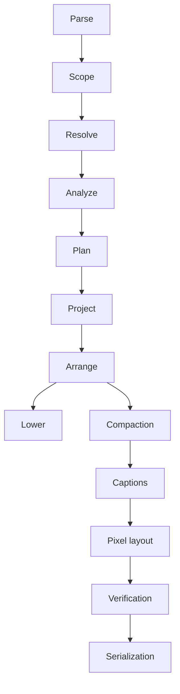

# Compiler and SVG Pipeline

This is an implementation map. The language and algorithm contracts live in
[the RFCs](rfcs/), including [stages](rfcs/0006-stages.md) and
[language refinements](rfcs/0007-language-refinements.md).

## Crate boundaries

| Crate                                                       | Responsibility                                                                                                                                  |
| ----------------------------------------------------------- | ----------------------------------------------------------------------------------------------------------------------------------------------- |
| [`kaalang`](../crates/kaalang/src/lib.rs)                   | Re-export the public macro; own executable examples, compile-fail tests, and generated fixture diagrams.                                        |
| [`kaalang-macros`](../crates/kaalang-macros/src/lib.rs)     | Validate attribute arguments, parse the function, and delegate expansion to the compiler.                                                       |
| [`kaalang-compiler`](../crates/kaalang-compiler/src/lib.rs) | Analyze flows, verify execution plans, project topology, decide and check arrangements, and lower plans to Rust.                                |
| [`kaalang-render`](../crates/kaalang-render/src/lib.rs)     | Compact verified arrangements using shared compiler checks and additional cycle-boundary checks.                                                |
| [`kaalang-svg`](../crates/kaalang-svg/src/lib.rs)           | Derive captions, measure and verify pixel geometry, compose stages, and serialize standalone SVG.                                               |
| [`kaalang-cli`](../crates/kaalang-cli/src/main.rs)          | Read source, call the SVG entry point, and write the completed diagram.                                                                         |
| [`kaalang-testing`](../crates/kaalang-testing/src/lib.rs)   | Share the executable fixture corpus, generated probes, cycle shapes, and performance harness. This crate is unpublished and used only by tests. |

```mermaid
flowchart TD
    P[Parse] --> SC[Scope]
    SC --> R[Resolve]
    R --> A[Analyze]
    A --> PL[Plan]
    PL --> PR[Project]
    PR --> AR[Arrange]
    AR --> L[Lower]
    AR --> C[Compaction]
    C --> X[Captions]
    X --> PX[Pixel layout]
    PX --> V[Verification]
    V --> S[Serialization]
```

## Compiler steps

| Step    | Implementation                                                                                                                                   | Algorithm                                                                                                                                                                       | Artifact                                                                                         |
| ------- | ------------------------------------------------------------------------------------------------------------------------------------------------ | ------------------------------------------------------------------------------------------------------------------------------------------------------------------------------- | ------------------------------------------------------------------------------------------------ |
| Parse   | [`parse/`](../crates/kaalang-compiler/src/parse/mod.rs)                                                                                          | Validate each statement locally, flatten cycle bodies in source order, append the implicit end block.                                                                           | Parsed `Flow`.                                                                                   |
| Scope   | [`scope.rs`](../crates/kaalang-compiler/src/scope.rs)                                                                                            | Give cycle-local wires unique internal keys while retaining authored spellings; record the outer wires each cycle body captures.                                                | Scoped `Flow`.                                                                                   |
| Resolve | [`resolve.rs`](../crates/kaalang-compiler/src/resolve.rs)                                                                                        | Check that every capture names an earlier producer and that declarations and mutability agree.                                                                                  | Wire-validated `Flow`.                                                                           |
| Analyze | [`analyze/`](../crates/kaalang-compiler/src/analyze/mod.rs), [`symbolic/validate.rs`](../crates/kaalang-compiler/src/symbolic/validate.rs)       | Validate reachability, captures, branch participation, placement, merges, and convergence over enumerated histories or exact execution conditions.                              | `Executions`, `Vec<WireMerge>`, and `Vec<ConvergenceGroup>`.                                     |
| Plan    | [`plan/`](../crates/kaalang-compiler/src/plan/mod.rs), [`symbolic/plan/`](../crates/kaalang-compiler/src/symbolic/plan/mod.rs)                   | Build a nested branch/join plan; independently replay it over the complete execution domain using the selected representation.                                                  | `ExecutionPlan`, packaged with preceding artifacts as `Analysis`.                                |
| Project | [`topology/`](../crates/kaalang-compiler/src/topology/mod.rs), [`symbolic/projection.rs`](../crates/kaalang-compiler/src/symbolic/projection.rs) | Build nodes, exits, junctions, cycle boundaries, connections, back edges, and placement-only order. Preserve per-history transitive reduction when taking the connection union. | `Topology`.                                                                                      |
| Arrange | [`construct/`](../crates/kaalang-compiler/src/construct/mod.rs)                                                                                  | Find abstract ranks, columns, corridors, lanes, and cycle contours; independently verify the witness.                                                                           | Verified `Arrangement`; `build` packages it with `Analysis` and `Topology` as a `SemanticModel`. |
| Lower   | [`codegen/`](../crates/kaalang-compiler/src/codegen/mod.rs)                                                                                      | Emit hygienic Rust from the verified execution plan. Diagram realizability is checked first, although code generation discards the arrangement.                                 | Lowered `ItemFn`.                                                                                |

[`analyze`](../crates/kaalang-compiler/src/lib.rs) returns an `Analysis` with a
verified plan but does not check diagram realizability. `build` adds topology
and arrangement; `expand` checks the expanded diagram before emitting Rust and
discards its arrangement. Macro expansion does not run compaction or SVG layout.

For each local flow, `build_with_options` always constructs the expanded
projection first. A collapsed SVG request constructs a second, collapsed
projection only after the expanded one succeeds.

## Execution representation

[`analyze_local`](../crates/kaalang-compiler/src/lib.rs) selects one of two
exact representations. Local flows with at most `ENUMERATED_HISTORY_LIMIT`
finite histories use the ordinary execution list. When the product of declared
alternatives exceeds that threshold,
[`symbolic/walk/`](../crates/kaalang-compiler/src/symbolic/walk/mod.rs) first
builds conditions and counts the actual domain with a capped query. A small
actual domain still uses the ordinary path.

Larger domains retain an ordered, reduced decision graph in
[`symbolic/condition.rs`](../crates/kaalang-compiler/src/symbolic/condition.rs).
It shares decision suffixes and records conditions for block participation,
producer occurrences, capture dependencies, and final outcomes. Cycles,
preparation, and stage transitions use this same representation without
unfolding iterations or visits. Validation, plan verification, and connection
reduction query the whole domain; concrete witnesses supply only union facts.
The algorithm is specified in
[RFC 0007 §5.1](rfcs/0007-language-refinements.md#51-finite-cycle-analysis); its
threshold is the implementation constant `ENUMERATED_HISTORY_LIMIT`.

[`Executions`](../crates/kaalang-compiler/src/executions.rs) hides the storage
choice. `len()` counts without materializing summaries. Access through its `Vec`
interface enumerates and caches the complete list; mutable access replaces the
conditional storage with that list. Explicit enumeration can still be
exponential. The ordinary implementation also serves as the reference for
[`symbolic/tests.rs`](../crates/kaalang-compiler/src/symbolic/tests.rs).

## Staged flows

A flow that declares stages uses separate local analyses and diagrams for
preparation and each stage. `Analysis::stages` and `SemanticModel::stages`
retain declaration order; reachability and Rust constructor ordering use the
shared transition graph.

Preparation is analyzed twice. The preliminary pass skips producer-usage checks
to find outer-plan bindings available on every completing route. Stage analyses
then determine which common wires they use; those dependencies are added to
preparation's transitions before the final pass checks usage.

| Step    | Implementation                                                                                                                                     | Algorithm                                                                                                                                                                                                                                                                                           |
| ------- | -------------------------------------------------------------------------------------------------------------------------------------------------- | --------------------------------------------------------------------------------------------------------------------------------------------------------------------------------------------------------------------------------------------------------------------------------------------------- |
| Split   | [`parse/stage.rs`](../crates/kaalang-compiler/src/parse/stage.rs)                                                                                  | Split preparation from the stage declarations, resolve every entry and declared output, and append one transition block per possible signal.                                                                                                                                                        |
| Analyze | [`stage.rs`](../crates/kaalang-compiler/src/stage.rs)                                                                                              | Derive common outer data, analyze the local parts with their boundary dependencies, and reject stages unreachable in the transition graph.                                                                                                                                                          |
| Arrange | [`topology/stage.rs`](../crates/kaalang-compiler/src/topology/stage.rs), [`construct/stage.rs`](../crates/kaalang-compiler/src/construct/stage.rs) | Order every other local sink before each transition, place a part's transitions on one final rank, and verify their row and distinct columns.                                                                                                                                                       |
| Lower   | [`codegen/stage.rs`](../crates/kaalang-compiler/src/codegen/stage.rs)                                                                              | Keep preparation's outer scope around a labeled dispatcher loop whose state is a balanced `Result` sum of the stage entries; each arm runs one stage's local plan, in visit order.                                                                                                                  |
| Compose | [`layout/staged.rs`](../crates/kaalang-svg/src/layout/staged.rs)                                                                                   | Measure each compacted part with the common entry and transition height, align transitions on one row, and place preparation left of stages in declaration order. Empty preparation contributes only the function header. Verify the composed rails and return contour against every part's bounds. |

## Arrangement algorithms

| Order      | Algorithm                               | What it does                                                                                                                                                                                                                         |
| ---------- | --------------------------------------- | ------------------------------------------------------------------------------------------------------------------------------------------------------------------------------------------------------------------------------------ |
| Primary    | Preferred, conflict-guided search       | Starts with earliest ranks, unsunk cycle tails, preferred contour sides, and direct corridors. A reported conflict widens the responsible route (`direct` → `deferred` → `aside`), flips the responsible contour, or sinks its tail. |
| Fallback 1 | Deciding sweep with straight back edges | Enumerates legal vertex/case-row events, frontier orders and shared-rail exchanges while solving persistent column inequalities. Completed witnesses are reconstructed and independently checked.                                    |
| Fallback 2 | Deciding sweep with flexible back edges | Repeats the complete sweep with variable, possibly bent back-edge corridors. Exhaustion rules out the remaining legal arrangements.                                                                                                  |

Static constraint contradictions can reject a topology before the sweep;
otherwise rejection requires exhaustion with flexible back edges. The production
searches have no timeout, retry, coordinate, or bend limit that can reject a
topology. The separate exhaustive procedure under
[`construct/tests/reference.rs`](../crates/kaalang-compiler/src/construct/tests/reference.rs)
is a test oracle, not a runtime fallback.

## Rendering steps and fallbacks

Structural compaction belongs to `kaalang-render` and retains a replacement only
after [`ArrangementVerifier`](../crates/kaalang-render/src/verify/mod.rs) checks
it with the compiler's shared arrangement checks and cycle-boundary checks.
`kaalang-svg` assigns dimensions and spacing to that compacted arrangement; the
recorded rows, columns, and corridors remain its structural input.

| Step                                                                                                        | Primary path                                                                                                                                                                                         | Artifact                           | Fallback                                                                                                                                                                            |
| ----------------------------------------------------------------------------------------------------------- | ---------------------------------------------------------------------------------------------------------------------------------------------------------------------------------------------------- | ---------------------------------- | ----------------------------------------------------------------------------------------------------------------------------------------------------------------------------------- |
| [Compaction](../crates/kaalang-render/src/compact.rs)                                                       | Iterate verified local simplifications: pull contours inward, shorten routes, merge lanes and columns, lift vertices, fold rows.                                                                     | Compacted `Arrangement`.           | Keep the previous verified arrangement whenever a candidate fails. The process finds a deterministic local fixed point, not a global minimum.                                       |
| [Labels and captions](../crates/kaalang-svg/src/captions/mod.rs), [text](../crates/kaalang-svg/src/text.rs) | Validate raw and interpreted label characters for XML; derive semantic labels and source text; interpret restricted Markdown and measure formulas once per caption.                                  | `Captions` and source text.        | A formula that cannot be laid out or exceeds the height limit stays literal; one wider than its label is clipped with an ellipsis.                                                  |
| [Pixel layout](../crates/kaalang-svg/src/layout/mod.rs)                                                     | Wrap measured text, realize the arrangement with narrow gaps for routing-only columns, and increase bounded slack when labels and back edges share a gap.                                            | `Scene`.                           | Retry the same arrangement with standard column spacing, including the same bounded slack loop. A visible cycle caption may shorten or disappear; its full text remains accessible. |
| [Verification](../crates/kaalang-svg/src/layout/mod.rs)                                                     | Check route geometry and arrangement correspondence, then labels, cycle boundaries, canvas bounds, and correspondence again after final translation. Verify staged composition before serialization. | Verified `Scene` or `StagedScene`. | None: an unverified scene is never serialized.                                                                                                                                      |
| [Serialization](../crates/kaalang-svg/src/svg/mod.rs)                                                       | Write escaped Unicode, embedded CSS, accessible text, nodes, boundaries, and paths to one standalone SVG string.                                                                                     | Standalone SVG `String`.           | None.                                                                                                                                                                               |

The SVG entry point is
[`render_source_with_options`](../crates/kaalang-svg/src/lib.rs): parse the Rust
file, select one flow, build the model, compact it, validate labels, lay it out,
verify it, and serialize it.
