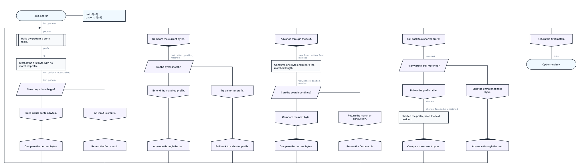

# RFC 0006: Stages

- Status: accepted
- Language: [RFC 0001: kaalang Language](0001-language.md)
- Visual language: [RFC 0002: kaalang Visual Language](0002-visual-language.md)
- Renderer: [RFC 0003: kaalang SVG Renderer](0003-svg-renderer.md)
- Lowering: [RFC 0004: kaalang Rust Lowering](0004-rust-lowering.md)
- Markdown: [RFC 0005: Markdown](0005-markdown.md)

## 1. Motivation and scope

An algorithm with several repeatable steps can already be expressed through a
cycle, a choice, and an explicitly maintained state that selects the next step.
A kaalang **stage** makes those steps explicit and lets the compiler generate
the dispatcher. The flow first prepares its data, then enters one stage at a
time through named control signals.

A stage behaves as a branch of that common dispatcher. Its entry signal selects
one visit and can carry a value into it. A completing visit selects one of the
stage's declared alternative exits, or the terminal stage completes the flow
with its structural return. A stage may instead diverge in a nested cycle.
Stages share the outer data scope established by preparation; their internal
blocks capture the entry value and other data they use.

This RFC defines stage syntax, execution, validation, Rust lowering, and
diagrams for staged flows. Stage bodies use the ordinary cycle, capture, and
convergence rules in [RFC 0001](0001-language.md), with the stage-specific
extensions defined here.

A transition's name selects its destination, and its value becomes that stage's
input. Ordinary functions transfer these values under Rust's ownership and
lifetime rules, including non-`Copy` owners. In a `const fn`, transition values
must implement `Copy`: this keeps the generated dispatch state free of
destructors even with generic payloads. The restriction follows the function's
`const` qualifier, including when it is called at runtime. Authored computations
still obey Rust's constant-evaluation rules. Data shared across visits can
remain in outer storage and be accessed through explicit captures.

### 1.1 Terms

This RFC uses RFC 0001's wire, producer, capture, branch, and merge terms, with
the following additions:

- A **stage** is a named kaalang sequence entered through one incoming signal.
- A **visit** is one execution of a stage body, with fresh local wires.
- A **transition** ends a completing preparation or stage route by selecting the
  next stage and supplying its entry value.
- A **signal** is a wire used to select control flow. A stage transition signal
  names its destination and carries the value received there.
- A stage's **entry** is its named incoming wire, bound for the current visit.
- A stage **export** passes a selected value to a destination stage through a
  transition.

## 2. Preparation and stage declarations

```rust
#[kaalang]
fn complete<T>(input: T) -> T {
    #[action("Begin processing.")]
    let finish = || ();

    #[stage("Return the input.")]
    |finish| {
        |input| return input;
    };
}
```

A flow containing stages has two consecutive sections:

1. **Preparation:** ordinary kaalang blocks that execute once, establish shared
   data, perform initial work, and select the initial stage.
2. **Stages:** the stage declarations, in authored order.

The first stage declaration ends preparation. Every later root statement must
also be a stage declaration. Preparation follows the ordinary source-order,
branch, merge, and cycle rules. Every preparation route that reaches the stage
section must supply exactly one entry signal.

A declaration has exactly one `#[stage("description")]` attribute containing a
nonempty Rust string literal, a header `|entry|` with one plain identifier, and
a braced kaalang sequence. Stage descriptions must be distinct within a flow,
comparing decoded Rust string values before Markdown interpretation; raw and
ordinary literals with the same value collide. A stage with completing
transitions declares its possible outputs before the header, for example
`let (count, finish) = |count| { ... };`. These are alternative outputs: a
completed visit provides exactly one. A terminal stage or a stage whose every
route diverges omits the output declaration or uses `let ()`.

The header receives the stage's entry signal and activates its whole body. Its
identifier names the received value as an immutable wire, available to explicit
inner captures for that visit. Entering the body counts as use of the signal
even when no inner block captures its value again. Stage declarations are
permitted directly in the root flow body. Their order determines their diagram
positions; transitions determine their execution order. The terminal stage, when
present, must be declared last. Without authored preparation, a function input
may enter only the first declared stage. A sole stage with no outgoing
transitions and no authored preparation is rejected; write an ordinary kaalang
flow instead. A sole stage with a self-transition remains valid. Preparation may
select any declared stage.

The receiver `self` cannot name a stage entry. It remains available as common
outer data under the ordinary receiver capture rules. To transfer an owned
receiver, first produce a named preparation wire such as
`let go = |self| self;`.

Entry names are unique across the flow. Raw and ordinary spellings identify the
same name. The names in these headers identify the flow's transition signals.
Each such signal has a Rust type, with a `Copy` bound in a `const fn`. All
producers targeting one entry, including initial producers in preparation or the
function inputs, must agree on its Rust type. Different entries can have
different types. Each declared stage output resolves to an entry, including the
stage's own entry for a self-transition. All headers and output declarations are
resolved before executable sequences are analyzed, so a transition can target an
earlier or later stage.

Using RFC 0001's description, identifier, and block notation:

```text
staged_flow_body := block_statement* stage_declaration+
stage_declaration :=
    "#[stage(" block_description ")]"
    ("let" output_pattern "=")?
    "|" identifier ","? "|" "{" block_statement* "}" ";"
```

Here `output_pattern` uses RFC 0001's named output bindings: one binding, a
tuple of bindings, or `()`. A stage output binding cannot carry `mut`; duplicate
names are invalid. Each destination receives an immutable entry, regardless of
the source wire's mutability. A tuple lists alternative exits rather than
destructuring one result: `(output,)` and `output` declare the same single exit
and transfer its whole value. The preparation statements of a staged flow are
subject to §4's completion rules. Section 5 describes cycles inside stages.

## 3. Data scope and signals

### 3.1 Outer data

Function inputs and preparation outputs establish the common outer data scope.
Preparation must make every outer wire used by a stage available at the stage
section's entry through ordinary branch and merge rules. A branch-local
preparation value must reach that common scope through its wire's merge before
stages can use it. Initial transition signals provide the selected entry; the
common outer data scope contains the remaining wires. A stage sees its current
entry value, not the preparation signal from an earlier visit.

Each stage body can use those outer data wires, its current entry, and its own
earlier local outputs. Each computational block or transfer explicitly captures
the wires it reads, using the existing `name`, `mut name`, `&name`, and
`&mut name` forms. For example, an action inside `|processing|` may capture
`|&mut values|`, where `values` was declared during preparation. Mutation
through a permitted mutable capture updates the shared wire for subsequent work
and subsequent stage visits.

The received entry binding cannot be captured with `&mut`. A value capture
`mut entry` remains valid wherever that capture form is supported: it moves or
copies the entry into a mutable block-local alias. To modify an owned entry
across several blocks, first produce a local wire such as
`let mut work = |entry| entry;`, then capture `&mut work`. An initial parameter
or preparation wire may be mutable in preparation; each receiving stage still
binds its entry immutably. This concerns the binding, not the value's type: an
entry carrying `&mut T` or interior mutability retains its ordinary Rust
behavior.

The enclosing function's generics, `Self`, and receiver remain in their ordinary
Rust context. Inner blocks that use the receiver capture it with RFC 0001 §5's
receiver spelling. A nested cycle imports its data through its own capture list
under RFC 0001 §4.5 (§5 here); its inner blocks capture those cycle bindings or
earlier iteration-local outputs. A `mut entry` cycle capture creates separate
mutable working storage without making the received stage entry mutable.

Stage-local wires are fresh on every visit. A declared output transfers its
selected value to the next stage by an ordinary Rust move or copy. Other local
values remain in the current stage; preserve them in outer state through a
mutable capture when needed by later visits. A stage-local producer cannot reuse
a name inherited from common outer data or the current entry, except for the
self-transition defined in §3.2. Different stages may reuse local names in their
separate scopes.

### 3.2 Entry and outgoing signals

A stage's entry signal activates one visit. Inside the body, captures resolve to
the visible entry, common outer data, or outputs of that visit. Each declared
stage output selects the same-named local wire produced directly in the body's
sequence. The declaration and the internal wire belong to separate scopes; the
declaration does not provide a wire inside the body. A matching internal
producer must exist, and each declared exit must be reachable. The incoming
entry alone does not supply a declared output; a transition requires a local
producer.

A question can select unit signals directly; a choice can provide different
values for its cases; an action, call, or completed cycle can produce a signal
alongside ordinary local outputs. Only names listed in the stage's output
declaration can leave it. An internal wire whose name matches another stage's
entry remains local when it is not listed. Its ordinary consumers and type
determine its local meaning.

A direct local output may reuse the stage's own entry name when that name is
also a declared output. This is the only exception to the prohibition on
shadowing an inherited wire. Captures before that first local declaration,
including captures of the declaring block, resolve to the entry. The declaration
then introduces a new body-local wire: in `let go = |go| ...`, the input is the
current entry and the output is the new local producer. Later captures resolve
to that local wire, with no fallback to the entry on another branch. The local
producer retains its ordinary `mut` permission; exporting its value still
creates an immutable entry for the next visit.

The entry and local output are distinct producer identities, not alternative
producers of one merged wire. Multiple local producers of the new name still
obey the ordinary alternative-producer, merge, and source-order rules. If later
work needs the incoming value as well, give it another local name before the
first declaration that shadows it. A nested cycle may read the visible wire but
cannot shadow an outer entry itself.

Exporting the new `go` requests another visit, whose header receives that value.
This also permits mutual transitions between stages. Every continuing visit must
explicitly select its successor.

A **transition boundary** is the end of a completing preparation or stage route,
where the selected signal is exported to its destination. A signal may be
produced before later work on that route; that remaining work executes in source
order before the transition.

A **boundary consumer** is the implicit by-value use of a wire selected for
export. It is not an authored block. At a transition boundary it consumes the
selected signal and supplies the destination's entry. In a `const fn`, that
value's type must implement `Copy`. Boundary consumers participate in the
ordinary scope, producer, branch, and merge checks. A branch-local signal cannot
be used after a merge has closed its branch. Alternative internal producers
retain their ordinary type and mutability agreement; the receiving stage binds
the exported value immutably.

Preparation selects its initial destination from its direct outputs or named
flow inputs matching stage entries. Such a name designates a transition signal,
including when it carries data; it is not also a common outer data wire. Rust
checks agreement with the destination's other incoming values and, in a
`const fn`, its `Copy` bound. The initial signal must remain available by value
until preparation's transition boundary, just like an outgoing stage signal. For
a non-`Copy` `go`, an action with `|go| go.clone()` moves the original into its
capture alias before cloning, so the initial signal is no longer available.
Borrowing forms such as `|&go| go.len()` or `|&go| go.clone()` preserve it; the
action's result follows the ordinary output and usage rules.

Inside a stage, only its declared outputs request transitions. A wire inside a
nested cycle must first leave it as a break value bound in the containing
sequence, then be exported by the stage, to request a transition.

### 3.3 Merge and source order

The ordinary rule remains in force for data: every producer is authored before
every consumer of its wire. Shared data is established before the stage section;
local producers precede local consumers. A mutable capture changes a stored
value under Rust's rules while keeping its original producer identity.

Within preparation or one stage, same-named output producers must be mutually
exclusive and merge before any consumer. This includes signal outputs. All work
that the merge waits for must precede its consumers, and alternative producers
must agree on type and mutability. Branch adjacency and convergence nesting
retain their existing rules.

A signal connection between stages has execution order across visits. Its
producer completes in one visit, then the receiving stage begins a fresh visit.
Its header may appear before the producer in the source. Producers in different
stages belong to separate local scopes and meet the same entry on different
visits. This signal graph can contain cycles while every visit retains an
acyclic local data-dependency order.

## 4. Execution and completion

Preparation executes once and leaves its shared data alive for the stage
section. Its initial signal determines the first stage. Each visit executes the
selected stage's body according to its verified local source and branch order.

At every route that reaches the end of preparation or a nonterminal stage:

1. In preparation, collect participating direct outputs matching stage entries.
   Named flow inputs matching entries can also supply the initial signal. In a
   stage, collect participating local wires named by its output declaration.
2. Require exactly one signal. Zero is an unfinished route; two or more are
   ambiguous and invalid. Alternative producers of one signal follow §3.3.
3. Require that signal to be available to the boundary consumer, consume it
   after the route's remaining work, finish the visit's local scope, and enter
   the stage with the matching entry name.

The rule is checked separately for each feasible route. A stage can have several
possible exits, like a select, while each completed visit chooses one. Export
consumes the internal producer, and the destination header consumes the exported
signal; both count toward ordinary usage and branch participation requirements.
A signal emitted during preparation is used only for the initial entry. Every
later transition uses a freshly produced signal.

Every route of a nonterminal stage either exports one declared signal or
diverges in a nested cycle. A stage whose every route diverges declares no
outputs. Reaching the end of the body requires a successor signal, including for
a transition back to the same stage. Divergence is structural under §6.1; an
opaque Rust expression does not establish it.

### 4.1 Terminal stage

A flow with stages may have one terminal stage. It contains the flow's sole
structural `return` and declares no outputs. Every completing route through that
stage reaches that return. It may perform ordinary computations, selections,
merges, and cycles before returning. The return completes the enclosing
function, and Rust checks its value against the function's declared result type.

In a staged flow the structural return belongs to this terminal stage.
Completing preparation and nonterminal-stage routes hand control onward through
signals. The author must declare the terminal stage last in the stage section.
Declaring another stage after it is a compile-time error. An empty stage is
invalid. A flow that diverges through transitions or cycles may omit the
terminal stage.

A cycle inside a stage completes through its declared outputs under
[RFC 0001 §§4.5–4.6](0001-language.md#45-cycle). The containing stage then
continues to its transition or terminal return.

### 4.2 Ownership and lifetimes

Outer data keeps its surrounding scope across stage visits. Each inner block's
captures perform ordinary Rust moves, copies, or borrows where that block runs.
A mutable borrow normally ends with its borrowing block; a derived reference
retains the usual Rust lifetime and borrowing restrictions. A terminal stage can
consume an owned outer value when it returns.

A continuing stage must leave outer data usable by subsequent executions. Rust
checks ownership in the generated dispatcher loop, including repeated moves and
borrows. Persistent owned values are normally borrowed or updated through
mutable captures. Storing a value in outer state moves it into that state's
ownership; remaining stage-local values leave scope before the next stage
begins.

References stored in outer state must have referents that live long enough. A
reference to a departing stage's owned local cannot survive the transition.
Destructors follow the scope of their owners. Block-owned values drop at block
exit; remaining branch-local owners drop when that branch closes, including
before a merge's shared continuation. Remaining owners in the stage body's
outermost scope drop at visit completion. Surviving outer owners retain their
enclosing scope until completion or an explicit move or drop. Export moves or
copies the selected transition value into the next dispatch state before those
local scopes end. A moved owner belongs to the receiving visit and is not
dropped by the departing one. A reference can cross a transition boundary only
when its referent outlives the receiving visits; a `Copy` bound does not extend
a local owner's lifetime.

A selected signal in preparation or a stage must remain usable by value until
its transition boundary. Earlier work can borrow it under ordinary Rust rules,
but moving a non-`Copy` signal into an earlier capture makes the later export
invalid. The same rules apply to entry captures: receiving an owned value does
not implicitly clone it for each consumer. A self-transition may move the
incoming entry through its local producer into the next visit.

## 5. Cycles inside stages

A cycle in preparation or a stage follows
[RFC 0001 §§4.5–4.6](0001-language.md#45-cycle). Its capture interface,
structural break, result bindings, and implicit repetition have the same meaning
as in a flow without stages.

A cycle and a stage both contain a kaalang sequence with its own local wires.
The cycle creates persistent input bindings from its header captures and returns
its break value to the containing sequence. A stage receives its selected entry
value, accesses common outer data through inner captures, and exports one of its
declared signals at visit completion.

| Property                                  | Cycle                                                           | Stage                                                  |
| ----------------------------------------- | --------------------------------------------------------------- | ------------------------------------------------------ |
| Entry header                              | Ordinary capture list                                           | One plain signal                                       |
| Data available inside                     | Persistent captured bindings and iteration-local outputs        | Common outer wires and the current entry value         |
| Data captures                             | Explicit on each inner computational block or transfer          | Explicit on each inner computational block or transfer |
| Output declaration                        | One result binding or simultaneous destructured results         | Named alternatives (`Copy` in a `const fn`)            |
| Completing route                          | Structural break supplies the result to the containing sequence | Exports one selected value to the destination stage    |
| Repeat                                    | Reaching the cycle body's end                                   | An output targeting the stage's own entry              |
| End reached without an output or transfer | Starts another iteration                                        | Invalid                                                |

When a stage receives `go` and a nested cycle captures `|go|`, that capture
moves or copies the entry into the cycle's persistent input binding. Inner
captures resolve to that binding. Borrowing captures instead borrow the stage's
data for the lifetime of the cycle; a mutable value capture creates the cycle's
own working state.

A cycle result requests a stage transition only when its binding supplies one of
the stage's declared outputs. Examples in §§8.3 and 8.5 show owned values
crossing both boundaries.

## 6. Validation and lowering

### 6.1 Finite analysis

Resolve stage entry and declared output names, then split a staged root into
preparation and stages. Analyze each sequence using the ordinary local branch,
capture, merge, and source-order rules in
[RFC 0001 §7](0001-language.md#7-execution-and-implicit-convergence). Each stage
receives the common outer data and its current entry value. Stage-level captures
establish dependencies to those producers; nested cycles resolve captures
through their own input bindings.

Determine preparation's common data from the bindings in its outer plan scope
that are available on every completing route. Follow shared continuations and
the values their merges carry into that scope. A branch-local producer remains
local even when all other preparation branches diverge.

Insert a boundary consumer for each declared output and each possible initial
signal from preparation. Validate its producer, scope, type, and merge order.
Stage output bindings reject `mut`, and received stage entries are immutable.
Nested cycles contribute their finite summaries under
[RFC 0004 §7](0004-rust-lowering.md#7-cycles).

Each stage summary ends at a declared transition boundary, the terminal return,
or a repeating cycle outcome. The destination's body belongs to another visit.
Construct the directed stage graph from those transition boundaries and compute
reachability from the preparation's initial entries. Reject unreachable stages
and unreachable executable blocks.

Validate one entry per stage, one selected signal per completing nonterminal
route, the terminal-stage rules, and producer usage across the reachable model.
Reject a terminal stage that is not the last declaration. The header's position
imposes diagram order and back-transition markers; signal connections determine
inter-stage reachability. Reject `&mut` captures of a stage's received entry;
cycle-local working bindings retain their own mutability permissions. Rust
checks type agreement of all values targeting each stage, data operations and
captures in generated scopes, and `Copy` bounds on stage entry signals in a
`const fn`.

As in RFC 0001, computational Rust bodies are opaque. Validation considers all
question answers and choice cases possible and does not prove termination or
correlations between visits. Finite local summaries and the stage graph describe
arbitrarily many transitions without unfolding them. Every reachable part must
have a conforming local diagram.

### 6.2 Rust lowering

Keep the parameter prologue and preparation's outer wire storage in the scope
surrounding the dispatcher, in original declaration order. Preserve owners from
the outer scope of the preparation plan even when stages only capture a derived
reference or do not capture the owner at all. Owners in branches and cycle
bodies retain those local scopes; only their exported or merged values survive.
Moving a value into an explicit capture still transfers its ownership normally.

Emit preparation's outer sequence with ordinary `let` initializers in that
surrounding scope, preserving Rust's temporary lifetime extension and drop
order. Only the remaining region that selects the initial transition is
evaluated in a labeled state initializer, followed by the dispatcher. The outer
sequence ends before a selection whose branches can transition without reaching
its shared continuation. Branch and iteration temporaries keep their own lexical
lifetimes.

Represent the state as a sum of stage entry types using fully qualified
`core::result::Result` variants. Split the stages into consecutive halves
recursively, with `Ok` selecting the left half and `Err` the right; one stage
needs only its payload. This keeps type depth logarithmic and introduces no type
name into authored scopes, including names resolved by authored macros. Rust
infers the payload types from incoming values, and all constructors for one
destination must agree on its type. In a `const fn`, each transition checks its
payload through a `const` identity function with a `core::marker::Copy` bound.
That helper lives only inside the generated boundary expression, after the
payload has been evaluated, so it cannot shadow authored code. Ordinary
functions need no such bound.

A mutable state binding records the selected stage and its value. Each match arm
binds that entry immutably and executes the stage's local plan. Direct captures
of that entry resolve to the visit-local storage. A nested cycle creates its
persistent capture bindings under RFC 0004 §7. A self-transition output receives
a separate hygienic binding, preserving §3.2's distinction from the incoming
wire. Common outer wires remain available through ordinary generated capture
aliases.

At a completed transition boundary, construct the destination variant with the
selected value and finish the current arm's local scopes. Construction checks
the destination type and, in a `const fn`, the value's `Copy` bound. The
constructor and its value argument retain the source location of the binding
that declares the signal: the stage's output declaration for an outgoing signal,
and for an initial signal preparation's last root-level producer of that name or
the function parameter that supplies it. Generated identifiers retain their
hygiene. Type and bound diagnostics point at that binding. The destination is
known from the resolved output name; choosing it requires no extra join label.
Ordinary merges of alternative producers still use RFC 0004's labeled blocks and
shared continuations. The next dispatch iteration enters the selected stage. The
terminal arm returns directly from the enclosing function. A wholly diverging
arm remains in its nested cycle and produces no next state. When a transition
boundary continues the dispatcher from inside generated labeled blocks, its
native `continue` names the hygienic dispatch-loop label. Cycle breaks and
implicit repeats target that cycle's own generated label under
[RFC 0004 §7](0004-rust-lowering.md#7-cycles).

For example, the counting flow in §8.1 has this illustrative lowering. As in RFC
0004, hygiene, parameter withdrawal, and lint details are omitted; the mutable
capture is shown explicitly:

```rust
fn count_to(limit: usize) -> usize {
    let mut wire_counter = 0usize;
    let mut stage = Ok(());
    loop {
        stage = match stage {
            Ok(()) => {
                if wire_counter >= limit {
                    let wire_finish = ();
                    Err(wire_finish)
                } else {
                    let wire_count = {
                        let counter = &mut wire_counter;
                        *counter += 1;
                    };
                    Ok(wire_count)
                }
            }
            Err(()) => return wire_counter,
        };
    }
}
```

For a `const fn`, the lowering checks `Copy` at each transition. Here two
alternative producers merge into one outgoing `finish` value. The ordinary merge
closes their branches before constructing the next state. The example shows the
identity helper once for readability; generated boundary expressions each keep
it in their own scope:

```rust
const fn select_value<T: Copy>(take_left: bool, left: T, right: T) -> T {
    const fn copy_entry<T: Copy>(value: T) -> T {
        value
    }

    let mut stage = Ok(copy_entry(()));
    loop {
        stage = match stage {
            Ok(()) => {
                let wire_finish = 'merge_finish: {
                    if take_left {
                        break 'merge_finish left;
                    } else {
                        break 'merge_finish right;
                    }
                };
                Err(copy_entry(wire_finish))
            }
            Err(finish) => return finish,
        };
    }
}
```

In a `const fn`, `Copy` excludes destructors from the generated state, including
for inferred generic payloads. This deliberately rejects even concrete
non-`Copy` transition types without destructors. The bound applies only to
transmitted entry values: common outer data may have arbitrary Rust types.
Ordinary functions use the same dispatcher without payload bounds; matching the
current variant moves its owned entry into the visit, and the next variant takes
ownership of its outgoing value. Authored operations and escaping borrows retain
ordinary Rust checks, including constant-evaluation restrictions in a
`const fn`.

Preserve each block's capture scope and all remaining route work before updating
the state. Keep storage accessible only through generated capture aliases as RFC
0004 requires. Ordinary branch lowering and the cycle lowering in
[RFC 0004 §7](0004-rust-lowering.md#7-cycles) apply inside each arm, including
merges of alternative outgoing producers. Shared continuations are emitted once.

The dispatcher preserves the enclosing generic and receiver context. Its stack
usage is independent of the number of transitions. It stores one active variant
and its entry value; authored outer storage and computations retain their own
memory requirements.

Correctness follows one visit at a time: preparation establishes the common data
and first entry; the local plan preserves each stage's effects; the selected
output supplies both the next arm and its entry value; and that arm observes the
surviving outer data with fresh local wires. These steps preserve both
completing and indefinitely repeating executions. The diagram uses the same
local plans and transition graph.

## 7. Visual representation

In a staged flow's diagram, a common upper rail connects stage entries,
transition nodes end their routes on a common lower row, and a lower rail
returns along the left edge of the whole diagram to the upper rail.

A **part** is the diagram area assigned to preparation or one stage, with its
own horizontal range. Preparation is the ordinary flow in the leftmost part: the
start capsule and its parameter panel lead into the authored blocks, which
compute the initial stage signal. It has no stage header. Stages occupy parts to
its right from left to right in declaration order. The terminal stage is
declared last, so its part is rightmost. Each part is sized for its local
arrangement, labels, and cycle boundaries.

The initial flow starts above the stage headers and runs directly into its
authored blocks, without a synthetic preparation header. The common upper rail
starts at the initial flow's axis below the start capsule and connects all stage
headers, which share one row. Removing the preparation header leaves a straight
vertical connection in its place. The rail is a symbolic link between transition
nodes and stage entries; it does not execute preparation again or add an
executable choice or entry to the middle of a stage.

When preparation contains no authored blocks, the input selects the first
declared stage directly. Omit the preparation part and its synthetic transition
node. Place the start capsule and parameter panel above that stage, with a
straight connection through the upper rail to its entry. Stages retain their
declaration order; the first occupies the leftmost part. Empty preparation
reserves no width.

### 7.1 Stage entry

A stage begins with the same shape as a case node in RFC 0002: a rectangular
text body ending in a lower triangular point. Reuse the case outline, text
placement, and sizing rules. The downward control connection leaves the lower
apex and enters the stage body. All stage entry and transition icons use a
common height large enough for their measured descriptions, so their outlines
align as well as their row centers.

The stage's displayed name is its authored description, rendered using
[RFC 0005](0005-markdown.md). It appears inside the entry node. Stage entry and
transition nodes have no separate signal-name captions.

Distinct decoded descriptions may render identically after Markdown
interpretation. Authors are responsible for keeping destination descriptions
distinguishable in the diagram; formatting does not affect the uniqueness check
in §2.

Common outer wires appear in the capture labels of the blocks that use them,
including their authored capture modifiers and the ordinary label-sharing rules.
The model records each wire's original producer in preparation or the function
inputs. The entry represents those available sources and its received signal for
local dependency routing. As in RFC 0002, data travels virtually along the
reduced control connections.

### 7.2 Transition node

Each transition boundary ends its selected route with a **transition node**
after all work on that route. All visible transitions, including nonempty
preparation's initial transitions, share one row below every part's body,
including expanded cycle boundaries and indefinitely repeating routes. Within a
part, transition columns follow local branch routing, independently of the order
of names in an output declaration. Distinct transition nodes occupy distinct
columns.

The transition node mirrors the stage entry vertically: a rectangular text body
with an upper triangular point. The incoming control connection meets that upper
apex. Execution continues at the target stage's entry through the symbolic link
recorded by the model.

Inside the transition node, repeat the destination stage's displayed name
exactly, with the same description rendering. The description comes from the
resolved header, so changing it updates the entry and all transitions targeting
it together. Stage signal names are omitted from producer hand-overs and merge
labels, including initial signals in preparation. Ordinary captures inside a
stage still name the data they use.

A transition node is a synthetic projection of the transition boundary, like a
merge or end node. Alternative local producers merge before a shared boundary
consumer under the ordinary rules. Distinct terminal routes remain distinct
unless local convergence already joins them. Preparation ends its continuing
routes with these same transition nodes.

### 7.3 Backward and self-transition markers

Number the stages in declaration order, from left to right. A transition from
stage `i` to stage `j` is **backward** when `j < i` and a **self-transition**
when `j == i`. Both receive a **back-transition marker**. A transition to a
later stage is forward. Preparation precedes all stages, so its initial
transitions are forward.

The marker is a small solid triangular cap at the node's apex, filled with the
outline color. Its sloping sides follow the surrounding triangular point, and
its horizontal base lies halfway from the apex to the base of that point. This
keeps the marker inside the outline and clear of the text. It remains visible in
monochrome diagrams.

Mark the two ends of every backward or self-transition:

- Fill the upper tip of its transition node.
- Fill the lower tip of its destination stage's entry node.

An entry receives one marker if at least one backward or self-transition targets
it. Each outgoing transition is classified independently: a forward transition
to a marked entry retains an unmarked tip. The classification depends on stage
declaration order. Transitions to the terminal stage are always forward because
it is declared last. The classification is the same in expanded and collapsed
cycle views.

For example, with stages `check`, `update`, and `finish` in that order:

| Transition            | Transition tip | Destination entry tip                           |
| --------------------- | -------------- | ----------------------------------------------- |
| Preparation → `check` | Unmarked       | Marked because of the backward transition below |
| `check` → `update`    | Unmarked       | Unmarked                                        |
| `update` → `check`    | Marked         | Marked                                          |
| `check` → `finish`    | Unmarked       | Unmarked                                        |

A self-transition marks both its own outgoing node and its stage's entry.

### 7.4 Composition and completion

The entry signal links each transition node to its unique destination. The model
records outer-wire provenance and the derived back-transition markers. Within a
part, branch order, wire routing, and merges follow the ordinary visual
language; cycles use the projection in
[RFC 0002 §4.8](0002-visual-language.md#48-cycle).

Each transition node's flat bottom connects vertically to a common lower rail,
including the initial transitions in preparation. A return line rises from that
rail outside the leftmost part, reaches the upper rail, and ends with a
right-pointing arrow at the leftmost part's entry axis. The target name on the
transition node selects the receiving stage. These contour segments carry no
wire captions and create no new data dependencies.

Check and arrange preparation and stages locally, then compose their verified
arrangements with preparation on the left and stages to its right in declaration
order. Empty preparation contributes only its measured function header above the
receiving stage. Inter-part links establish reachability and data provenance;
local arrangements supply the drawn routes. The shared model owns these
decisions, and rendering consumes the same stage graph as lowering.

The upper rail clears the measured start node, parameter panel, and outgoing
wire labels, including their text halo. Check the composed rails against each
part's nodes, labels, parameter panel, and cycle boundaries after placement.

The shared topology keeps preparation's ordinary start; only stages receive
entry nodes. It orders all other local sinks before each transition.
Construction places each part's transitions on one final rank, and the common
arrangement verifier checks their row and distinct columns. The fallback
construction treats the transition nodes as one row event, taking their
horizontal order from the incoming routes. Compaction must preserve these
constraints.

Renderers measure the local verified arrangements with the common icon height,
choose a transition row that clears every part's body, and enlarge the gap
before each part's final rank to reach it, accounting for the part's vertical
offset. Local routes and labels are recalculated and checked using those
measured rows. No node is moved after verification.

For empty preparation, retain the verified start geometry and parameter panel as
a header-only projection. Its sole transition is represented by the direct
connection to the receiving stage. Place that header above the stages and check
the composed rails and bounds normally. This presentation does not change the
shared stage graph or its local stage arrangements. If no part, including
preparation, has a transition node, omit the lower return rail.

Composition reserves preparation's start and parameter panel, both horizontal
rails, and the return line outside the leftmost part when computing the canvas.
Horizontal spacing between parts follows their body bounds. The parameter panel
sits above the stage section and may extend over its horizontal range; it
enlarges the canvas without reserving an extra column beside preparation. The
contour stays outside the local bodies except at the entry and transition node
ports and the upper rail's junction below start. SVG serialization draws the
measured geometry with one shared background; local part backgrounds must not
hide the contour.

There is one end node in the terminal stage, below all other vertices of that
local part. It is not stretched down to the transition row or connected to the
return contour. That stage keeps its authored horizontal position. A fully
diverging flow has no end node.

## 8. Examples

The `kaalang` attribute is assumed to be in scope in all examples.

### 8.1 Shared counter and a self-transition

```rust
#[kaalang]
fn count_to(limit: usize) -> usize {
    #[action("Initialize the counter.")]
    let mut counter = || 0usize;

    #[action("Begin counting.")]
    let count = || ();

    #[stage("Count to the limit.")]
    let (count, finish) = |count| {
        #[question("Has the limit been reached?")]
        let (finish, again) = |counter, limit| counter >= limit;

        #[action("Increment and count again.")]
        let count = |again, &mut counter| {
            *counter += 1;
        };
    };

    #[stage("Return the count.")]
    |finish| {
        |counter| return counter;
    };
}
```

`counter` is produced once during preparation. Each visit reads and may mutate
that same wire. The `count` output chooses another visit, while `finish` selects
the terminal stage. The header's signal activates all blocks participating in
that visit; each inner block captures its own data and branch dependencies.

### 8.2 Mutual transitions followed by a terminal stage

```rust
#[kaalang]
fn is_even(mut remaining: usize) -> bool {
    #[action("Prepare the result and start at even parity.")]
    let (mut result, even) = || (false, ());

    #[stage("An even number of steps has been taken.")]
    let (finish, odd) = |even| {
        #[question("Have all steps been taken?")]
        let (done, again) = |remaining| remaining == 0;

        #[action("Record an even result.")]
        let finish = |done, &mut result| {
            *result = true;
        };

        #[action("Take one step.")]
        let odd = |again, &mut remaining| {
            *remaining -= 1;
        };
    };

    #[stage("An odd number of steps has been taken.")]
    let (finish, even) = |odd| {
        #[question("Have all steps been taken?")]
        let (done, again) = |remaining| remaining == 0;

        #[action("Record an odd result.")]
        let finish = |done, &mut result| {
            *result = false;
        };

        #[action("Take one step.")]
        let even = |again, &mut remaining| {
            *remaining -= 1;
        };
    };

    #[stage("Return the parity.")]
    |finish| {
        |result| return result;
    };
}
```

The `remaining` and `result` wires outlive the stage visits. Each producing
stage selects `finish` on its own completing route. The declarations and diagram
use the same order: `even`, `odd`, `finish`. Both transitions to `finish` are
forward; the transition from `odd` to `even` is backward.

### 8.3 A cycle inside a stage

```rust
#[kaalang]
fn drain(input: Vec<u8>) -> usize {
    #[stage("Remove every item.")]
    let finish = |input| {
        #[cycle("Drain the collection.")]
        let finish = |mut input| {
            #[question("Is the collection empty?")]
            let (done, occupied) = |&input| input.is_empty();

            |done, input| break input;

            #[action("Remove one item.")]
            |occupied, &mut input| {
                input.pop();
            };
        };
    };

    #[stage("Return the remaining length.")]
    |finish| {
        #[action("Read the length.")]
        let length = |finish| finish.len();

        |length| return length;
    };
}
```

The flow input enters the first stage. The cycle moves it into a mutable
persistent input binding. The occupied route removes one item and repeats when
it reaches the body's end. The completing route breaks with the collection; the
cycle binds it as `finish`, which the stage transfers to the terminal visit.

### 8.4 Divergence through transitions

```rust
#[kaalang]
fn spin() -> ! {
    #[action("Begin repeating.")]
    let repeat = || ();

    #[stage("Repeat indefinitely.")]
    let repeat = |repeat| {
        #[action("Select another visit.")]
        let repeat = || ();
    };
}
```

Each visit produces a fresh signal to select the next visit. The stage has one
exit and the flow is fully diverging.

### 8.5 Forwarding an owned value through a cycle

```rust
#[kaalang]
fn forward<T>(go: T) -> T {
    #[stage("Forward the incoming value.")]
    let finish = |go| {
        #[cycle("Complete on the first iteration.")]
        let finish = |go| {
            #[action("Provide the incoming value.")]
            let finish = |go| go;

            |finish| break finish;
        };
    };

    #[stage("Return the value.")]
    |finish| {
        |finish| return finish;
    };
}
```

The flow input selects the first stage. The cycle header moves or copies that
visit's `go` into a persistent input binding. The action transfers it into the
iteration-local `finish`, and the break supplies the cycle's result. That result
then crosses the stage's transition boundary before the terminal stage returns
it. Both stage entries carry the unconstrained type `T`; this ordinary function
can forward a `String` or another non-`Copy` owner. Declaring this staged
function `const` would require `T: Copy` for its stage entries. The cycle needs
no such bound because its move occurs only on a completing route.

### 8.6 A self-transition with a new entry value

```rust
#[kaalang]
const fn count_down(count: usize) -> usize {
    #[stage("Count down to zero.")]
    let (count, finish) = |count| {
        #[choice("Is another step needed?")]
        #[case("Take the next step.")]
        #[case("The count is zero.")]
        let (count, finish) = |count| match count {
            value if value > 0 => value - 1,
            _ => 0usize,
        };
    };

    #[stage("Return zero.")]
    |finish| {
        |finish| return finish;
    };
}
```

The choice captures the incoming `count` before declaring its new local output
of that name. The selected output either supplies the next visit's smaller count
or enters `finish`. The incoming and outgoing `count` occurrences do not merge
within one visit.

### 8.7 Knuth–Morris–Pratt search

KMP finds the first occurrence of a byte pattern in a byte slice. Its search
naturally separates into stages for comparison, advancement, and fallback to a
shorter matching prefix. Every transition finishes the current visit; no visit
leaves a recursive call or a subproblem waiting to resume.

Preparation calls `prefix_table(pattern)`, an ordinary flow with nested cycles.
For each position `i`, `prefix[i]` is the length of the longest proper prefix of
`pattern[..=i]` that is also its suffix. The table stays in the common outer
data scope alongside the text position and the length already matched.

```rust
#[kaalang]
fn kmp_search(text: &[u8], pattern: &[u8]) -> Option<usize> {
    #[call("Build a table for reusing matched beginnings of the pattern.")]
    let prefix = |pattern| prefix_table(pattern);

    #[action("Start at the first text byte with no pattern bytes matched.")]
    let (mut position, mut matched) = || (0usize, 0usize);

    #[question("Is the pattern empty?")]
    #[no("NO")]
    #[yes("YES")]
    let (nonempty, empty) = |pattern| pattern.is_empty();

    #[action("An empty pattern matches at the start of the text.")]
    let finish = |empty| Some(0usize);

    #[question("Can the pattern fit inside the text?")]
    #[yes("YES")]
    #[no("NO")]
    let (compare, too_long) = |nonempty, text, pattern| pattern.len() <= text.len();

    #[action("The pattern is longer than the text; report no match.")]
    let finish = |too_long| None;

    #[stage("Compare the next pattern byte.")]
    let (step, retry) = |compare| {
        #[action("Read the current text byte and the next unmatched pattern byte.")]
        let (text_byte, pattern_byte) =
            |text, pattern, position, matched| (text[position], pattern[matched]);

        #[question("Do these two bytes match?")]
        #[yes("YES")]
        #[no("NO")]
        let (extend, retry) = |text_byte, pattern_byte| text_byte == pattern_byte;

        #[action("Count this byte as one more matched pattern byte.")]
        let step = |extend, matched| matched + 1;
    };

    #[stage("Move to the next text byte.")]
    let (compare, finish) = |step| {
        #[action("Move past this text byte and remember how many pattern bytes matched.")]
        |step, &mut position, &mut matched| {
            *position += 1;
            *matched = step;
        };

        #[question("Has the whole pattern matched?")]
        #[no("NO")]
        #[yes("YES")]
        let (remaining, found) = |pattern, matched| matched == pattern.len();

        #[action("Report where the matching part of the text begins.")]
        let finish = |found, position, matched| Some(position - matched);

        #[question("Are there more text bytes to read?")]
        #[yes("YES")]
        #[no("NO")]
        let (compare, exhausted) = |remaining, text, position| position < text.len();

        #[action("The text has ended without a full match; report no match.")]
        let finish = |exhausted| None;
    };

    #[stage("Reuse a shorter match.")]
    let (compare, step) = |retry| {
        #[question("Have any bytes at the start of the pattern already matched?")]
        #[yes("YES")]
        #[no("NO")]
        let (shorten, skip) = |matched| matched > 0;

        #[action("Use the table to keep a shorter matched beginning; retry this text byte.")]
        let compare = |shorten, &prefix, &mut matched| {
            *matched = prefix[*matched - 1];
        };

        #[action("Start a new match after this text byte.")]
        let step = |skip| 0usize;
    };

    #[stage("Return the search result.")]
    |finish| {
        |finish| return finish;
    };
}
```

[Executable search and tests](../../crates/kaalang/tests/gallery/kmp_search/mod.rs)
and
[prefix-table diagram](../../crates/kaalang/tests/gallery/kmp_search/prefix_table.svg).

[](../../crates/kaalang/tests/gallery/kmp_search/kmp_search.svg)

The `compare` and `retry` entries carry unit signals. `step` carries the new
matched length: comparison supplies `matched + 1`, while fallback at zero
supplies `0` to skip an unmatched text byte. `finish` carries `Option<usize>`.
An empty pattern selects it immediately with `Some(0)`; a pattern longer than
the text selects `None`. A successful search returns the first match's byte
offset.

Before each comparison, `position < text.len()` and `matched < pattern.len()`.
The `matched` bytes immediately before `position` equal `pattern[..matched]`. A
successful comparison advances both positions; a mismatch with a nonempty
matched prefix follows `prefix[matched - 1]` without advancing through the text.
That fallback strictly shortens the prefix and returns to comparison of the same
text byte. A mismatch at zero advances only the text position. Advancement
checks completion before requesting the next comparison, keeping every indexed
read in bounds.

The text position never decreases, and each fallback decreases a matched length
that can grow only when a byte is consumed. Together with linear prefix-table
construction, this gives `O(text.len() + pattern.len())` time and
`O(pattern.len())` table space. Stage visits use constant stack space under the
lowering in §6.2.

## 9. Changes to earlier RFCs

This RFC supersedes the provisions below for flows declaring stages. Earlier
released RFC texts remain unchanged. Ordinary flow and cycle rules continue to
apply within preparation and each stage unless explicitly changed here.

- **RFC 0001 §§2–4 and §8:** introduce stage declarations after preparation. A
  stage has one entry and declared alternative outputs, which require `Copy`
  only in a `const fn`. A terminal stage contains the flow's sole return and
  declares no outputs and must be declared last; a wholly diverging stage also
  declares none. Entry values are visible to inner captures as immutable wires,
  and stage output bindings reject `mut`. A declared local self-transition
  output may shadow only its own stage entry, with the distinct producer
  identities and resolution order of §3.2.
- **RFC 0001 §§4.7, 5–7:** place a staged flow's return in its terminal stage.
  Stage bodies access outer data through inner block captures and create fresh
  local scopes per visit. Ordinary data producer order, ownership, scope, local
  merges, and convergence restrictions remain. Stage signal links can cross
  declaration order and form cycles between visits.
- **RFC 0002 §§3–8:** use case-shaped stage entries and mirrored transition
  nodes with destination labels and backward/self markers. Draw stages beside
  the ordinary preparation flow, with aligned stage entries and transition
  nodes, an upper entry rail, and a lower return contour. Outer wires appear in
  their consumers' capture labels, while existing control connections carry the
  dependency routes. The terminal stage is declared last and occupies the
  rightmost part; its end stays below all other vertices of that local part.
- **RFC 0003 §§1–3:** compose locally verified stage arrangements and preserve
  symbolic stage links and the diagram geometry and serialization defined in
  §7.4 here.
- **RFC 0004 §§1–2 and §5:** retain shared data around the generated stage
  dispatcher, carry each selected entry in its enum variant, and emit the
  terminal return directly from its arm. Each arm binds its received entry
  immutably. Standard enum variants carry inferred payload types without
  introducing generated type names into authored scopes. Transition checks
  require `Copy` only in `const` functions. Ordinary functions transfer owned
  values without those bounds. Constructor checks report diagnostics at the
  binding that declares the signal, as in §6.2 here.

Concrete compiler and renderer types remain implementation choices.

## 10. Acceptance scenarios

These scenarios define required stage behavior and visual representation in
addition to the ordinary flow and cycle rules in RFCs 0001–0004.

| Scenario                                                                         | Required result                                                                                                                           |
| -------------------------------------------------------------------------------- | ----------------------------------------------------------------------------------------------------------------------------------------- |
| Preparation followed by stage declarations                                       | Run preparation once and select the first stage through its signal.                                                                       |
| Ordinary root statement after the first stage                                    | Reject the interleaved preparation block.                                                                                                 |
| Nested stage declaration                                                         | Reject it; declarations belong to the root stage section.                                                                                 |
| Empty, multiple, or modified stage header captures                               | Reject; a stage header has one plain entry identifier.                                                                                    |
| Duplicate stage entries, including raw spellings                                 | Reject the ambiguous destination.                                                                                                         |
| Stage output without a matching entry                                            | Reject the unresolved destination.                                                                                                        |
| Duplicate declared outputs or a declared output with no reachable local producer | Reject the invalid output interface.                                                                                                      |
| Internal wire named like another stage but absent from declared outputs          | Keep it local, with its ordinary type and usage rules.                                                                                    |
| Non-Copy stage transition in an ordinary or const function                       | In an ordinary function, transfer ownership under normal Rust rules; in a const function, reject even a concrete type with no destructor. |
| Const function called at runtime                                                 | Keep the Copy requirement on its stage entries; the function declaration determines the bound.                                            |
| Owned stage entry forwarded through a self-transition                            | Move it through the local output into the next visit without cloning or dropping the transferred owner.                                   |
| Non-Copy initial or outgoing stage signal moved before its boundary consumer     | Reject the export as a use after move; borrowing before export follows ordinary Rust rules.                                               |
| Preparation action clones a non-Copy initial signal                              | A value capture moves the original before cloning and prevents export; a shared capture preserves the initial signal.                     |
| Stage transition fails its type or const Copy check                              | Locate the diagnostic at the binding that declares the signal under §6.2, preserving its source span.                                     |
| Several declared exits on alternative stage routes                               | Each completed visit selects exactly one.                                                                                                 |
| Zero or simultaneous outputs on a completing stage route                         | Reject the unfinished or ambiguous route.                                                                                                 |
| Remaining work after an exported wire is produced                                | Finish the selected route before exporting its output.                                                                                    |
| Branch-local exit wire consumed after a merge closes its branch                  | Reject under ordinary scope and merge ordering rules.                                                                                     |
| Self-transition and mutual transitions                                           | Reuse outer data and create fresh local scopes with bounded dispatch stack usage.                                                         |
| Inner stage block captures a preparation wire                                    | Resolve it directly to the common outer producer.                                                                                         |
| Inner computational body reads an uncaptured wire                                | Reject according to ordinary capture rules.                                                                                               |
| Branch-local preparation data missing at entry to the stage section              | Require an ordinary merge before stage consumers.                                                                                         |
| Capture of a wire local to another stage                                         | Reject the unavailable wire.                                                                                                              |
| Repeated local producers in a stage visit                                        | Require mutual exclusion, merge completion, and producer order before consumers.                                                          |
| Mutable outer state and borrowing blocks                                         | Later visits observe updates; data borrows begin at their actual capturing blocks.                                                        |
| Owned outer value consumed by the terminal return                                | Move it into the result under ordinary Rust ownership rules.                                                                              |
| Repeated move of owned outer state on a continuing route                         | Let Rust reject invalid repeated use in the generated loop.                                                                               |
| Reference to a departing local stored in shared state                            | Reject the escaping borrow.                                                                                                               |
| Branch-local and body-local owners with destructors                              | Drop branch locals before the merge continuation and remaining body locals when the visit ends.                                           |
| Methods, generics, and otherwise valid const functions                           | Preserve the Rust context and ordinary receiver capture rules.                                                                            |
| Nested cycle result used as a transition                                         | Return through each cycle's break and result binding before exporting the stage signal.                                                   |
| Unit signal remains inside a cycle without becoming a result                     | Keep it local; it does not select a stage.                                                                                                |
| Terminal stage before another stage                                              | Reject; the author must declare the terminal stage last.                                                                                  |
| Stage entry and outgoing transition                                              | Use the case outline for entry and its vertical mirror for transition, with matching destination names.                                   |
| Position of a transition node                                                    | Align all transition nodes below the local bodies, including preparation; preserve branch order.                                          |
| Backward or self-transition                                                      | Mark the transition tip and the destination entry tip.                                                                                    |
| Forward transition to an entry also targeted backward                            | Keep that transition unmarked and mark the shared destination entry once.                                                                 |
| Transition to the terminal stage                                                 | Draw it as a forward transition to the last declared stage, without a backward marker.                                                    |
| Several stages with identical descriptions                                       | Reject the repeated decoded description, including ordinary and raw literals with the same value.                                         |
| Stage captures and collapsed-cycle inputs                                        | Show outer stage wires at their capturing blocks and the cycle's authored capture interface on its collapsed node.                        |
| Expanded and collapsed cycle views                                               | Preserve cycle results, break and repetition behavior, and surrounding stage links and markers.                                           |
| Terminal stage declares an output, return in preparation, or multiple returns    | Reject the invalid completion structure.                                                                                                  |
| Stage route ending without a signal or return                                    | Reject an empty stage or a route reaching its body end without a selected signal or return.                                               |
| Divergence through stage transitions                                             | Accept with declared signal exits and no terminal stage.                                                                                  |
| Unreachable stage                                                                | Reject using finite graph reachability.                                                                                                   |
| KMP search with a separate prefix-table flow                                     | Match direct search on empty inputs, absent and repeated patterns, and overlapping prefixes; preserve the text position during fallback.  |
| Copy values on stage transitions                                                 | Carry unit, primitives, tuples, arrays, shared references, and user-defined Copy types under ordinary Rust lifetime rules.                |
| Different entry types and several producers for one entry                        | Infer each destination type independently; reject mismatched incoming types.                                                              |
| &mut capture of a received stage entry or mut on a stage output binding          | Reject; the received entry is immutable and stage output declarations carry no mut permission. A cycle's own working binding is separate. |
| Mutable value capture of a stage entry                                           | Allow mut entry wherever that capture form is supported; it creates a mutable block-local alias under ordinary move or copy rules.        |
| Mutable initial parameter or preparation wire                                    | Allow mutation during preparation; bind the receiving stage entry immutably.                                                              |
| Stage entry carries a mutable reference or interior mutability                   | Preserve ordinary Rust behavior of the value; entry immutability concerns its binding.                                                    |
| Stage-local producer shadows a common outer wire or the current entry            | Reject except for a declared self-transition output; alternative local producers still follow ordinary merge rules.                       |
| Function input or direct preparation output named after an entry                 | Treat it as an initial transition value, with a Copy bound only in a const function; it is not common outer data.                         |
| Singleton stage output pattern                                                   | Treat (found,) and found as the same single output, transferring its whole value.                                                         |
| Stage entry captured through a nested cycle                                      | Move, copy, or borrow it into the cycle's persistent input binding; resolve inner captures to that binding.                               |
| Local self-transition output sharing the stage entry name                        | Captures through its first declaration read the entry; subsequent captures read the new local wire.                                       |
| Mutable local self-transition producer                                           | Allow mutable captures of the new local wire; exporting it creates an immutable entry for the next visit.                                 |
| Same-named local alternatives after entry shadowing                              | Apply normal merge ordering to the local producers; never fall back to the incoming entry on a sibling branch.                            |
| Stage whose every route diverges in a nested cycle                               | Accept when reached from preparation or another stage, with no declared outputs, transition node, or terminal return.                     |
| Stage entry row and stage return contour                                         | Keep preparation on the left without a stage header; return transitions to the stage entry rail without entering preparation again.       |
| Empty preparation                                                                | Omit its column and initial transition node; place the function header above the first declared stage.                                    |
| Sole stage without preparation or outgoing transitions                           | Reject; use an ordinary flow.                                                                                                             |
